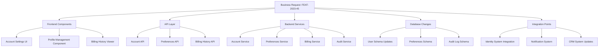

# Feature Lifecycle & Traceability Guide

> **DOCUMENTATION EXAMPLE ONLY**: This document contains workflow examples for reference purposes. These examples demonstrate implementation patterns but are not meant to be used directly.

This guide demonstrates how to implement end-to-end traceability from business feature requests through technical implementation and testing, following the guidelines in [100-feature-separation.mdc](mdc:departments/engineering/architecture/100-feature-separation.mdc).

## Table of Contents

1. [Feature Lifecycle Overview](#feature-lifecycle-overview)
2. [Business-to-Implementation Traceability](#business-to-implementation-traceability)
3. [Feature Identification System](#feature-identification-system)
4. [Implementation Tracing Examples](#implementation-tracing-examples)
5. [Test Coverage Mapping](#test-coverage-mapping)
6. [Feature Documentation](#feature-documentation)
7. [Integration with DevOps Tooling](#integration-with-devops-tooling)

## Feature Lifecycle Overview

The complete feature lifecycle in an enterprise environment follows these stages:

1. **Business Request**: Capturing stakeholder requirements
2. **Feature Definition**: Converting business needs to defined features
3. **Technical Planning**: Breaking down features into technical tasks
4. **Implementation**: Developing the feature across system layers
5. **Testing**: Ensuring the feature meets requirements
6. **Deployment**: Releasing the feature to production
7. **Monitoring**: Tracking feature usage and performance
8. **Feedback Loop**: Gathering insights for feature improvement

Each stage must maintain clear traceability to business requirements and between technical components.

## Business-to-Implementation Traceability

### Feature Request Identification

Every feature should begin with a standardized business request:

```yaml
# Example Feature Request Document
feature_id: FEAT-2023-45
title: Customer Account Self-Service Portal
business_owner: Sarah Johnson, Director of Customer Service
priority: High
business_value: >
  Enable customers to manage their own account information, 
  reducing support calls by an estimated 30% and improving 
  customer satisfaction scores.
success_metrics:
  - Reduce account-related support tickets by 25% within 3 months
  - Achieve 70% customer adoption within 6 months
  - Maintain CSAT score above 4.5/5 for the feature

requirements:
  - Customers must be able to update contact information
  - Customers must be able to manage communication preferences
  - Customers must be able to view billing history
  - Changes must be reflected in all downstream systems within 5 minutes
  - Must comply with data protection regulations
  - Must be accessible on mobile devices

constraints:
  - Must integrate with existing identity management system
  - Must maintain audit trail of all changes
  - Phase 1 deployment needed by Q3
```

### Technical Architecture Mapping

Map business requirements to technical components:



## Feature Identification System

### Feature ID Structure

Use a consistent identification system for features:

```
FEAT-[YYYY]-[Sequential Number]-[Sub-feature letter (optional)]
```

Example:

- `FEAT-2023-45`: Main feature
- `FEAT-2023-45-A`: Sub-feature A
- `FEAT-2023-45-B`: Sub-feature B

### Code Identification

Use consistent identifiers in code and documentation:

```typescript
/**
 * @feature FEAT-2023-45
 * @component Account Settings
 * @requirement REQ-2023-45-001 Enable contact information updates
 */
export class AccountSettingsComponent {
  // Implementation
}
```

```typescript
/**
 * @feature FEAT-2023-45
 * @service Account Service
 * @requirement REQ-2023-45-001 Enable contact information updates
 * @requirement REQ-2023-45-002 Update downstream systems within 5 minutes
 */
export class AccountService {
  // Implementation
}
```

## Implementation Tracing Examples

### Database Layer

```sql
-- @feature FEAT-2023-45
-- @component User Schema
-- @requirement REQ-2023-45-001 Enable contact information updates

-- Create detailed audit trail table
CREATE TABLE user_profile_changes (
  change_id SERIAL PRIMARY KEY,
  user_id INT NOT NULL REFERENCES users(id),
  change_type VARCHAR(50) NOT NULL,
  field_name VARCHAR(100) NOT NULL,
  old_value TEXT,
  new_value TEXT,
  changed_by INT NOT NULL REFERENCES users(id),
  change_timestamp TIMESTAMP NOT NULL DEFAULT CURRENT_TIMESTAMP,
  feature_id VARCHAR(20) NOT NULL, -- Tracks which feature triggered the change
  request_id VARCHAR(50), -- For traceability to specific request
  CONSTRAINT valid_change_type CHECK (change_type IN ('UPDATE', 'CREATE', 'DELETE'))
);

-- Create index for efficient querying by user
CREATE INDEX idx_user_profile_changes_user_id ON user_profile_changes(user_id);
```

### Backend Service

```typescript
/**
 * @feature FEAT-2023-45
 * @service Account Service
 * @requirement REQ-2023-45-001 Enable contact information updates
 * @requirement REQ-2023-45-002 Update downstream systems within 5 minutes
 */
@Injectable()
export class ProfileUpdateService {
  constructor(
    private readonly userRepository: UserRepository,
    private readonly auditService: AuditService,
    private readonly integrationService: IntegrationService,
    private readonly eventBus: EventBus
  ) {}

  /**
   * Updates user profile information and propagates changes to relevant systems
   * @feature FEAT-2023-45
   * @requirement REQ-2023-45-001 Enable contact information updates
   */
  async updateProfile(
    userId: string,
    profileData: ProfileUpdateDto
  ): Promise<UserProfile> {
    const user = await this.userRepository.findById(userId);

    if (!user) {
      throw new UserNotFoundException(userId);
    }

    // Create audit record of changes
    const changes = this.detectChanges(user.profile, profileData);

    // Update user profile
    const updatedUser = await this.userRepository.updateProfile(
      userId,
      profileData
    );

    // Log audit trail
    await this.auditService.logChanges({
      userId,
      entityType: "USER_PROFILE",
      changes,
      featureId: "FEAT-2023-45",
      source: "SELF_SERVICE_PORTAL",
    });

    // Publish event for downstream systems
    // Requirement: Update downstream systems within 5 minutes
    await this.eventBus.publish(
      new UserProfileUpdatedEvent({
        userId,
        changes,
        timestamp: new Date(),
      })
    );

    // Return updated profile
    return updatedUser.profile;
  }

  // Additional implementation details...
}
```

### API Layer

```typescript
/**
 * @feature FEAT-2023-45
 * @component Account API
 * @requirement REQ-2023-45-001 Enable contact information updates
 */
@Controller("users/:userId/profile")
export class UserProfileController {
  constructor(private readonly profileService: ProfileUpdateService) {}

  /**
   * Updates user profile information
   * @feature FEAT-2023-45
   */
  @Put()
  @UseGuards(AuthGuard, UserAccessGuard)
  async updateProfile(
    @Param("userId") userId: string,
    @Body() profileData: ProfileUpdateDto,
    @CurrentUser() currentUser: UserContext,
    @RequestId() requestId: string
  ): Promise<ApiResponse<UserProfileDto>> {
    // Validate access
    this.validateAccess(userId, currentUser);

    // Update profile
    const updatedProfile = await this.profileService.updateProfile(
      userId,
      profileData,
      { requestId, initiatedBy: currentUser.id }
    );

    // Transform to DTO
    const responseData = this.profileMapper.toDto(updatedProfile);

    // Return formatted response
    return {
      success: true,
      data: responseData,
      metadata: {
        featureId: "FEAT-2023-45",
        requestId,
      },
    };
  }

  // Additional endpoints...
}
```

### Frontend Component

```typescript
/**
 * @feature FEAT-2023-45
 * @component Profile Management
 * @requirement REQ-2023-45-001 Enable contact information updates
 */
@Component({
  selector: "app-profile-editor",
  templateUrl: "./profile-editor.component.html",
  styleUrls: ["./profile-editor.component.scss"],
})
export class ProfileEditorComponent implements OnInit {
  @Input() userId: string;
  profileForm: FormGroup;
  isSubmitting = false;
  isLoadingProfile = true;
  error: string | null = null;

  constructor(
    private fb: FormBuilder,
    private profileService: ProfileService,
    private analytics: AnalyticsService,
    private logger: LoggingService
  ) {
    // Initialize form
    this.profileForm = this.fb.group({
      firstName: ["", Validators.required],
      lastName: ["", Validators.required],
      email: ["", [Validators.required, Validators.email]],
      phone: ["", Validators.pattern(/^\+?[0-9]{10,15}$/)],
      address: this.fb.group({
        street: ["", Validators.required],
        city: ["", Validators.required],
        state: ["", Validators.required],
        zipCode: ["", Validators.required],
        country: ["", Validators.required],
      }),
    });
  }

  ngOnInit() {
    this.loadProfile();
  }

  // Load existing profile data
  async loadProfile() {
    try {
      this.isLoadingProfile = true;
      const profile = await this.profileService.getProfile(this.userId);
      this.profileForm.patchValue(profile);
      this.analytics.trackEvent("PROFILE_VIEW", {
        featureId: "FEAT-2023-45",
        userId: this.userId,
      });
    } catch (error) {
      this.error = "Failed to load profile information";
      this.logger.error("ProfileEditorComponent.loadProfile failed", {
        error,
        userId: this.userId,
        featureId: "FEAT-2023-45",
      });
    } finally {
      this.isLoadingProfile = false;
    }
  }

  // Submit profile changes
  async saveProfile() {
    if (this.profileForm.invalid) {
      this.markFormGroupTouched(this.profileForm);
      return;
    }

    try {
      this.isSubmitting = true;
      const profileData = this.profileForm.value;
      await this.profileService.updateProfile(this.userId, profileData);

      this.analytics.trackEvent("PROFILE_UPDATE", {
        featureId: "FEAT-2023-45",
        userId: this.userId,
        fieldsUpdated: this.getChangedFields(),
      });
    } catch (error) {
      this.error = "Failed to update profile information";
      this.logger.error("ProfileEditorComponent.saveProfile failed", {
        error,
        userId: this.userId,
        featureId: "FEAT-2023-45",
      });
    } finally {
      this.isSubmitting = false;
    }
  }

  // Helper methods...
}
```

## Test Coverage Mapping

### Unit Test with Feature Identification

```typescript
/**
 * @feature FEAT-2023-45
 * @tests REQ-2023-45-001 Enable contact information updates
 */
describe("ProfileUpdateService", () => {
  let service: ProfileUpdateService;
  let userRepository: MockUserRepository;
  let auditService: MockAuditService;
  let eventBus: MockEventBus;

  beforeEach(() => {
    userRepository = new MockUserRepository();
    auditService = new MockAuditService();
    eventBus = new MockEventBus();

    service = new ProfileUpdateService(
      userRepository,
      auditService,
      new MockIntegrationService(),
      eventBus
    );
  });

  /**
   * @requirement REQ-2023-45-001 Enable contact information updates
   */
  describe("updateProfile", () => {
    it("should update the user profile with valid data", async () => {
      // Arrange
      const userId = "user-123";
      const profileData = {
        firstName: "John",
        lastName: "Doe",
        email: "john.doe@example.com",
        phone: "+15551234567",
      };
      const existingUser = createMockUser({ id: userId });
      userRepository.findById.mockResolvedValue(existingUser);
      userRepository.updateProfile.mockResolvedValue({
        ...existingUser,
        profile: {
          ...existingUser.profile,
          ...profileData,
        },
      });

      // Act
      const result = await service.updateProfile(userId, profileData);

      // Assert
      expect(userRepository.updateProfile).toHaveBeenCalledWith(
        userId,
        profileData
      );
      expect(result).toEqual(expect.objectContaining(profileData));
    });

    /**
     * @requirement REQ-2023-45-002 Update downstream systems within 5 minutes
     */
    it("should publish event to notify downstream systems", async () => {
      // Arrange
      const userId = "user-123";
      const profileData = { firstName: "John" };
      userRepository.findById.mockResolvedValue(createMockUser({ id: userId }));
      userRepository.updateProfile.mockResolvedValue(
        createMockUser({
          id: userId,
          profile: profileData,
        })
      );

      // Act
      await service.updateProfile(userId, profileData);

      // Assert
      expect(eventBus.publish).toHaveBeenCalledWith(
        expect.objectContaining({
          userId,
          changes: expect.any(Array),
        })
      );
    });

    // Additional tests...
  });
});
```

### Integration Test with Feature Mapping

```typescript
/**
 * @feature FEAT-2023-45
 * @tests Integration between components for profile updates
 */
describe("Profile Update Integration", () => {
  let app: INestApplication;
  let userRepository: UserRepository;
  let auditRepository: AuditRepository;
  let testUser: User;

  beforeAll(async () => {
    const moduleRef = await Test.createTestingModule({
      imports: [AppModule],
    }).compile();

    app = moduleRef.createNestApplication();
    await app.init();

    userRepository = moduleRef.get<UserRepository>(UserRepository);
    auditRepository = moduleRef.get<AuditRepository>(AuditRepository);

    // Create test user
    testUser = await userRepository.create({
      email: "test@example.com",
      password: "password123",
      profile: {
        firstName: "Original",
        lastName: "Name",
        phone: "+11111111111",
      },
    });
  });

  afterAll(async () => {
    await app.close();
  });

  /**
   * @requirement REQ-2023-45-001 Enable contact information updates
   * @requirement REQ-2023-45-002 Update downstream systems within 5 minutes
   */
  it("should update profile and create audit trail", async () => {
    // Arrange
    const authToken = await getAuthToken(app, testUser.email, "password123");
    const updatedProfile = {
      firstName: "Updated",
      lastName: "User",
      phone: "+12223334444",
    };

    // Act
    const response = await request(app.getHttpServer())
      .put(`/users/${testUser.id}/profile`)
      .set("Authorization", `Bearer ${authToken}`)
      .send(updatedProfile)
      .expect(200);

    // Assert - Response validation
    expect(response.body.data).toMatchObject(updatedProfile);
    expect(response.body.metadata.featureId).toBe("FEAT-2023-45");

    // Assert - Database updated
    const updatedUser = await userRepository.findById(testUser.id);
    expect(updatedUser.profile).toMatchObject(updatedProfile);

    // Assert - Audit trail created
    const auditEntries = await auditRepository.findByEntity(
      "USER_PROFILE",
      testUser.id
    );
    expect(auditEntries).toHaveLength(1);
    expect(auditEntries[0]).toMatchObject({
      entityType: "USER_PROFILE",
      userId: testUser.id,
      featureId: "FEAT-2023-45",
    });

    // Assert - Event was published (mock check)
    const eventBus = app.get<EventBus>(EventBus);
    expect(eventBus.publish).toHaveBeenCalledWith(
      expect.objectContaining({
        type: "USER_PROFILE_UPDATED",
        userId: testUser.id,
      })
    );
  });

  // Additional integration tests...
});
```

### End-to-End Test with Feature Mapping

```typescript
/**
 * @feature FEAT-2023-45
 * @tests Full end-to-end flow for profile updates
 */
describe("Profile Management E2E", () => {
  let page: Page;
  let browser: Browser;
  const testUser = {
    email: "e2e-test@example.com",
    password: "e2eTestPassword",
    id: "",
  };

  beforeAll(async () => {
    // Setup test environment
    browser = await chromium.launch();

    // Create test user in the database
    testUser.id = await setupTestUser(testUser.email, testUser.password);
  });

  afterAll(async () => {
    await browser.close();
    await cleanupTestUser(testUser.id);
  });

  beforeEach(async () => {
    page = await browser.newPage();

    // Log in
    await page.goto(`${E2E_URL}/login`);
    await page.fill('input[name="email"]', testUser.email);
    await page.fill('input[name="password"]', testUser.password);
    await page.click('button[type="submit"]');

    // Wait for dashboard to load
    await page.waitForSelector("text=Dashboard");
  });

  afterEach(async () => {
    await page.close();
  });

  /**
   * @requirement REQ-2023-45-001 Enable contact information updates
   */
  test("User can update their profile information", async () => {
    // Navigate to profile page
    await page.click("text=Account Settings");
    await page.waitForSelector("text=Profile Information");

    // Verify initial form values
    expect(await page.inputValue('input[name="firstName"]')).toBe("E2E");
    expect(await page.inputValue('input[name="lastName"]')).toBe("Test");

    // Update profile information
    await page.fill('input[name="firstName"]', "Updated");
    await page.fill('input[name="lastName"]', "Name");
    await page.fill('input[name="phone"]', "+15551234567");

    // Save changes
    await page.click('button:has-text("Save Changes")');

    // Verify success message
    await page.waitForSelector("text=Profile updated successfully");

    // Reload page to verify persistence
    await page.reload();
    await page.waitForSelector("text=Profile Information");

    // Verify updated values
    expect(await page.inputValue('input[name="firstName"]')).toBe("Updated");
    expect(await page.inputValue('input[name="lastName"]')).toBe("Name");
    expect(await page.inputValue('input[name="phone"]')).toBe("+15551234567");

    // Verify analytics event was triggered
    const analyticsEvents = await page.evaluate(() => {
      return window.testHelpers.getAnalyticsEvents();
    });

    expect(analyticsEvents).toContainEqual(
      expect.objectContaining({
        event: "PROFILE_UPDATE",
        featureId: "FEAT-2023-45",
      })
    );
  });

  // Additional E2E tests...
});
```

## Feature Documentation

### Living Feature Documentation

Maintain living documentation for each feature:

```markdown
# Feature: Customer Account Self-Service Portal (FEAT-2023-45)

## Overview

The Customer Account Self-Service Portal enables customers to manage their own
account information without needing to contact customer service.

## Business Requirements

- Customers must be able to update contact information (REQ-2023-45-001)
- Customers must be able to manage communication preferences (REQ-2023-45-002)
- Customers must be able to view billing history (REQ-2023-45-003)
- Changes must be reflected in all downstream systems within 5 minutes (REQ-2023-45-004)
- Must comply with data protection regulations (REQ-2023-45-005)
- Must be accessible on mobile devices (REQ-2023-45-006)

## Implementation Components

### Frontend

- Account Settings UI (`src/features/account/settings/AccountSettings.tsx`)
- Profile Management Component (`src/features/account/profile/ProfileEditor.tsx`)
- Billing History Viewer (`src/features/account/billing/BillingHistory.tsx`)

### API Endpoints

- Account API (`src/api/users/:userId/profile`)
- Preferences API (`src/api/users/:userId/preferences`)
- Billing History API (`src/api/users/:userId/billing/history`)

### Services

- Account Service (`src/services/AccountService.ts`)
- Preferences Service (`src/services/PreferencesService.ts`)
- Billing Service (`src/services/BillingService.ts`)
- Audit Service (`src/services/AuditService.ts`)

### Database Changes

- User Schema Updates (`migrations/20230601_update_user_profile.sql`)
- Preferences Schema (`migrations/20230601_create_user_preferences.sql`)
- Audit Log Schema (`migrations/20230601_create_audit_logs.sql`)

## Testing Coverage

- Unit Tests: 97%
- Integration Tests: 85%
- E2E Tests: 100% of critical paths

## Deployment Status

- Development: Complete
- QA: Approved
- Staging: Deployed
- Production: Scheduled for 2023-07-15

## Monitoring

- Dashboard: [Link to Monitoring Dashboard]
- Key Metrics:
  - Usage rate: 243 profile updates per day
  - Error rate: 0.3%
  - Average load time: 1.2s

## Related Features

- FEAT-2023-12: Single Sign-On Implementation
- FEAT-2023-33: Customer Communication Preferences
```

## Integration with DevOps Tooling

### Git Commit Pattern

Use feature IDs in commit messages:

```
[FEAT-2023-45] Add profile update API endpoint

- Implements REQ-2023-45-001 for contact information updates
- Adds appropriate validation and error handling
- Includes audit logging for all changes
```

### CI/CD Pipeline Configuration

```yaml
# GitHub Actions workflow example
name: Feature FEAT-2023-45 Pipeline

on:
  push:
    branches:
      - feature/FEAT-2023-45-*
  pull_request:
    branches: [main, develop]
    paths:
      - "src/features/account/**"
      - "src/api/users/**"
      - "src/services/Account*"
      - "src/services/Preferences*"

jobs:
  test:
    runs-on: ubuntu-latest
    steps:
      - uses: actions/checkout@v3

      - name: Setup Node.js
        uses: actions/setup-node@v3
        with:
          node-version: "16"

      - name: Install dependencies
        run: npm ci

      - name: Run feature-specific unit tests
        run: npm run test -- --selectProjects=unit --testPathPattern="(account|user|profile)"

      - name: Run feature-specific integration tests
        run: npm run test -- --selectProjects=integration --testPathPattern="(account|user|profile)"

      - name: Report test coverage
        run: npm run report-coverage

      - name: Update feature documentation
        if: github.event_name == 'push'
        run: npm run update-feature-docs FEAT-2023-45

  # Additional build and deployment jobs...
```

### Feature Flag Configuration

```json
{
  "flags": {
    "profile-self-service": {
      "featureId": "FEAT-2023-45",
      "description": "Customer Account Self-Service Portal",
      "defaultValue": false,
      "environments": {
        "development": true,
        "staging": true,
        "production": false
      },
      "rolloutPercentage": {
        "production": 0
      },
      "requirements": ["REQ-2023-45-001", "REQ-2023-45-002"],
      "dependencies": ["FEAT-2023-12"]
    }
  }
}
```

## Related Documents

- [Feature Flag Standards](mdc:departments/engineering/operations/feature-flags.mdc)
- [CI/CD Pipeline Guidelines](mdc:departments/engineering/devops/cicd-pipelines.mdc)
- [Testing Strategy Guidelines](mdc:departments/engineering/testing/test-strategy.mdc)
- [Business Requirements Documentation Standards](mdc:departments/product/business-requirements.mdc)
