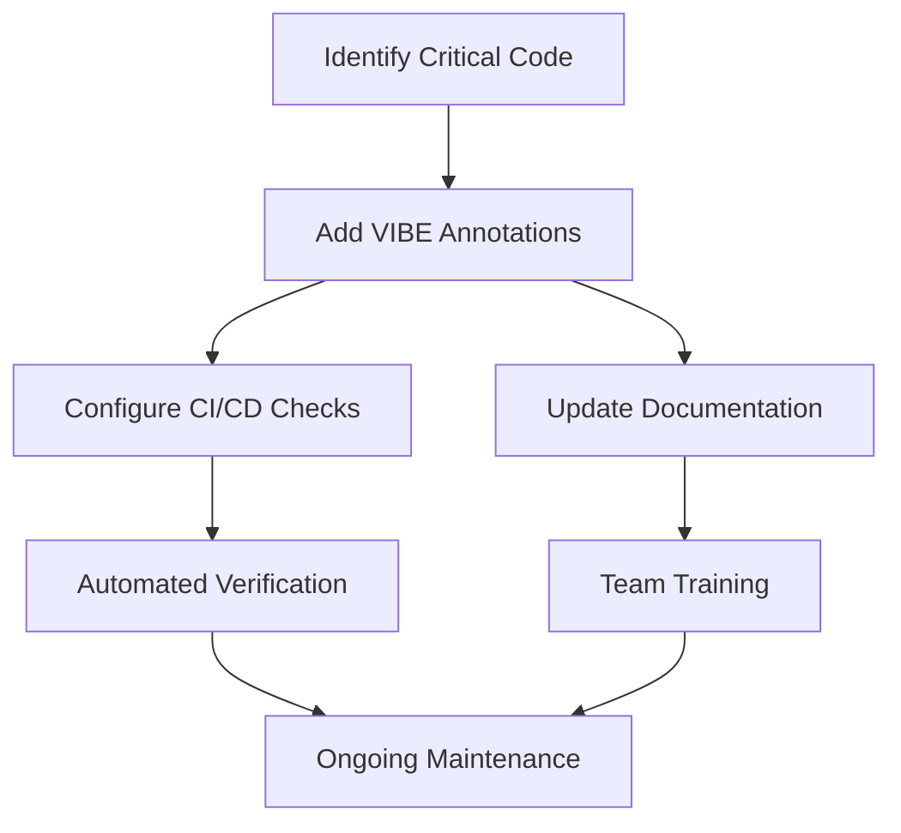

# VIBE Coding: Value-Informed, Behavioral-Embedded AI Collaboration Guide

> **DOCUMENTATION EXAMPLE ONLY**: This document contains guidance and examples for reference purposes. These examples demonstrate implementation patterns but are not meant to be imported or used directly.

This guide explains VIBE (Value-Informed, Behavioral-Embedded) coding practices for effective collaboration between developers and AI assistants.

## Table of Contents

1. [What is VIBE Coding?](#what-is-vibe-coding)
2. [Key VIBE Principles](#key-vibe-principles)
3. [Implementation Patterns](#implementation-patterns)
4. [Organizational Integration](#organizational-integration)
5. [Best Practices](#best-practices)

## What is VIBE Coding?

VIBE coding is a methodology that explicitly communicates values, intentions, and constraints to AI systems through code, documentation, and configuration. It embeds behavior guidelines directly into development artifacts to ensure AI tools respect critical boundaries and developer intentions.

Key characteristics:

- **Value-Informed**: Explicitly communicating what matters (protection, quality, intent)
- **Behavioral-Embedded**: Directly encoding expected AI behaviors in development artifacts
- **Human-AI Collaboration**: Structured approach for effective human-AI teamwork
- **Protection-Oriented**: Safeguarding critical code and infrastructure

## Key VIBE Principles

### 1. Explicit Intent Declaration

Clearly state what should and should not be modified:

```javascript
/**
 * @ai-intent This module handles critical payment processing
 * @ai-can-modify Format of log messages, error handling
 * @ai-cannot-modify Business logic, compliance checks, security controls
 */
```

### 2. Value Markers

Communicate what's important and why:

```javascript
/**
 * @ai-value HIGH - Regulatory compliance
 * This code implements specific regulatory requirements from
 * Section 3.4.2 of the Financial Services Regulation Act.
 * Changes may have legal implications.
 */
function validateTransactionCompliance() {
  // Implementation...
}
```

### 3. Boundary Demarcation

Clearly mark boundaries for AI modifications:

```javascript
// @ai-zone-start: SAFE TO MODIFY
function formatUserInterface() {
  // UI formatting code that's safe to enhance
}
// @ai-zone-end

// @ai-zone-start: REVIEW REQUIRED
function validateUserInput() {
  // Input validation that needs human review if modified
}
// @ai-zone-end

// @ai-zone-start: DO NOT MODIFY
function calculateRegulatoryFees() {
  // Critical financial calculations - do not modify
}
// @ai-zone-end
```

### 4. Behavioral Instructions

Embed specific instructions for AI behavior:

```javascript
/**
 * @ai-behavior When making changes to this file:
 * 1. Preserve all security checks
 * 2. Add unit tests for any modified functions
 * 3. Update documentation comments
 * 4. Do not modify parameter types or return values
 */
```

## Implementation Patterns

### File Headers with VIBE Annotations

Add standardized headers to critical files:

```javascript
/**
 * @file Payment Processing Service
 * @module finance/payments
 *
 * @ai-vibe-version 1.0
 * @ai-review-level HIGH
 * @ai-owners finance-team@example.com
 *
 * @ai-protection-reason This module implements critical financial
 * logic that has been audited and approved for regulatory compliance.
 *
 * @ai-modification-guidelines
 * - DO NOT modify core transaction processing logic
 * - DO NOT change parameter types or return values
 * - MAY improve error handling with equivalent security
 * - MAY update comments and documentation
 * - MAY add logging (but not for sensitive data)
 * - MUST add tests for any changes
 */
```

### Protected Regions with VIBE Comments

Mark specific code sections:

```javascript
function processPayment(paymentDetails) {
  // Regular code, AI can suggest improvements
  validateInputFormat(paymentDetails);
  logAttempt(paymentDetails);

  /* @ai-protected-region
   * Reason: This section implements the exact algorithm specified
   * in the payment processor's compliance documentation v2.3.
   * It has been audited for security and regulatory compliance.
   */
  const encryptedPayload = preparePayload(paymentDetails);
  const transactionId = generateSecureTransactionId();
  const result = submitToPaymentProcessor(encryptedPayload, transactionId);
  validateResponse(result);
  /* @ai-end-protected-region */

  // Regular code, AI can suggest improvements
  return formatResponse(result);
}
```

### Configuration-Based VIBE

Create a structured configuration file:

```json
// vibe-config.json
{
  "version": "1.0",
  "organization": "ACME Financial",
  "protection": {
    "critical-paths": [
      {
        "path": "src/core/payment-processing.js",
        "reason": "Audited financial logic",
        "protectionLevel": "high",
        "owners": ["finance-team"],
        "aiModificationRules": {
          "allowed": ["comments", "formatting", "error-handling"],
          "prohibited": [
            "business-logic",
            "security-controls",
            "api-contracts"
          ],
          "requiresReview": ["performance-optimizations"]
        }
      },
      {
        "path": "src/utils/compliance/*.js",
        "reason": "Regulatory compliance",
        "protectionLevel": "high",
        "owners": ["legal-team"],
        "expirationDate": "2025-06-30"
      }
    ],
    "default-rules": {
      "allowed": ["all"],
      "prohibited": ["security-controls"],
      "requiresReview": ["api-changes", "database-schema"]
    }
  }
}
```

## Organizational Integration

### VIBE for Teams

1. **Standardize Annotations**: Create company-wide standards for VIBE annotations
2. **Documentation**: Include VIBE guidelines in onboarding and code standards
3. **Automation**: Implement linters and validators for VIBE annotations
4. **Review Process**: Include VIBE marker review in code reviews

### Example Team Workflow



### Governance Model

VIBE annotations should be governed through:

1. **Classification System**: Define protection levels (high, medium, low)
2. **Ownership Assignment**: Clearly identify who owns protected code
3. **Regular Reviews**: Schedule periodic reviews of protection markers
4. **Expiration Policies**: Set time limits after which protections must be reviewed
5. **Exception Process**: Define how to request changes to protected code

## Best Practices

### Effective Annotations

1. **Be Specific**: Clearly state what can and cannot be modified
2. **Explain Why**: Always include the reason for protection
3. **Provide Context**: Reference regulations, business rules, etc.
4. **Include Contacts**: List who to contact for questions
5. **Include Alternatives**: Suggest how to extend functionality without modifying protected code

### Common Patterns

1. **Feature Flags**: Use VIBE with feature flags to control AI modifications
2. **Extension Points**: Design code with clear extension points as alternatives to modifying protected code
3. **Graduated Protection**: Use different levels of protection based on criticality
4. **Time-Limited Protection**: Add expiration dates to protection markers
5. **Visualized Protection**: Use IDE plugins to highlight protected regions

### Anti-Patterns to Avoid

1. **Over-Protection**: Marking too much code as protected
2. **Vague Instructions**: Failing to specify exactly what can/cannot be modified
3. **Missing Rationale**: Not explaining why protection is needed
4. **Stale Protections**: Not reviewing and updating protection markers
5. **Inconsistent Annotations**: Using different annotation formats across the codebase

## Conclusion

VIBE coding provides a structured methodology for human-AI collaboration that preserves critical values while enabling AI to contribute effectively. By embedding behavioral guidance directly in development artifacts, teams can protect what matters while still leveraging AI capabilities.

For specific implementation examples, refer to the [Do No Harm Examples](mdc:../file-operations/DoNoHarmExamples.md) document.
