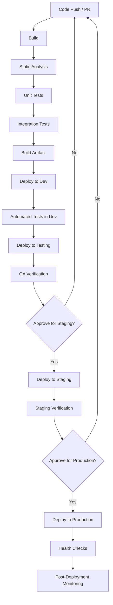

# Deployment Pipeline Template

This document provides a reference implementation for deployment pipelines that adhere to the enterprise standards defined in the [Deployment Infrastructure Standards](../../departments/engineering/operations/200-deployment-infrastructure.mdc).

## CI/CD Workflow Architecture



## GitHub Actions Workflow Example

```yaml
# .github/workflows/deployment-pipeline.yml
name: Deployment Pipeline

on:
  push:
    branches: [main, develop]
  pull_request:
    branches: [main, develop]

jobs:
  build:
    name: Build and Test
    runs-on: ubuntu-latest
    steps:
      - uses: actions/checkout@v3

      - name: Set up environment
        uses: actions/setup-node@v3
        with:
          node-version: "18"
          cache: "npm"

      - name: Install dependencies
        run: npm ci

      - name: Static code analysis
        run: npm run lint

      - name: Run unit tests
        run: npm run test:unit

      - name: Run integration tests
        run: npm run test:integration

      - name: Build artifact
        run: npm run build

      - name: Upload artifact
        uses: actions/upload-artifact@v3
        with:
          name: build-artifact
          path: dist/

  deploy-dev:
    name: Deploy to Development
    needs: build
    runs-on: ubuntu-latest
    if: github.event_name == 'push' && github.ref == 'refs/heads/develop'
    environment: development
    steps:
      - uses: actions/download-artifact@v3
        with:
          name: build-artifact
          path: dist/

      - name: Deploy to development environment
        run: |
          # Deployment script or command here
          echo "Deploying to development environment"

      - name: Run automated tests against dev
        run: |
          # Test automation script
          echo "Running automated tests in development"

  deploy-staging:
    name: Deploy to Staging
    needs: deploy-dev
    runs-on: ubuntu-latest
    if: github.event_name == 'push' && github.ref == 'refs/heads/develop'
    environment:
      name: staging
      url: https://staging.example.com
    steps:
      - uses: actions/download-artifact@v3
        with:
          name: build-artifact
          path: dist/

      - name: Deploy to staging environment
        run: |
          # Deployment script or command here
          echo "Deploying to staging environment"

      - name: Verify deployment
        run: |
          # Health check script
          echo "Verifying deployment in staging"

  deploy-production:
    name: Deploy to Production
    needs: deploy-staging
    runs-on: ubuntu-latest
    if: github.event_name == 'push' && github.ref == 'refs/heads/main'
    environment:
      name: production
      url: https://example.com
    steps:
      - uses: actions/download-artifact@v3
        with:
          name: build-artifact
          path: dist/

      - name: Deploy to production environment
        run: |
          # Deployment script or command here
          echo "Deploying to production environment"

      - name: Run post-deployment health checks
        run: |
          # Health check script
          echo "Running health checks in production"

      - name: Tag release
        run: |
          # Tag the release with version number
          echo "Tagging release"
```

## Pipeline Phase Guidelines

### 1. Build Phase

- Compile code and assemble dependencies
- Generate static assets
- Create a deployable artifact
- Store artifact in a persistent location
- Run static code analysis

### 2. Test Phase

- Run unit tests
- Run integration tests
- Check code coverage
- Measure performance (if applicable)
- Validate dependencies are up-to-date and secure

### 3. Deploy Phase

- Progressive deployment through environments:
  - Development (automatic)
  - Testing/QA (automatic after approval)
  - Staging (manual approval required)
  - Production (manual approval required)
- Environment-specific configuration applied
- Database migrations run
- Static assets deployed to CDN (if applicable)

### 4. Verification Phase

- Health checks run post-deployment
- Key metrics monitored for anomalies
- Synthetic transactions executed
- Rollback triggered if verification fails

## Environment-Specific Considerations

### Development Environment

- Deployments should be frequent and automatic
- May use feature branches for parallel development
- Data refreshes from production (sanitized) as needed

### Testing/QA Environment

- Stable environment for formal testing
- Data refreshes from production (sanitized) on schedule
- May include specialized testing tools not in other environments

### Staging Environment

- Must mirror production in configuration and scale (possibly scaled down)
- Used for final validation before production
- Used for performance testing

### Production Environment

- Deployment windows should be scheduled and communicated
- Additional security measures during deployment
- Progressive rollout strategies (if applicable)

## Monitoring and Observability

Each deployment should establish or update:

- Application logs
- Performance metrics
- Error tracking
- User analytics (if applicable)
- Service health dashboards

## Integration with Other Systems

- Change Management System
- Release Notes
- Documentation Updates
- Support Team Notification

## Implementation Checklist

- [ ] Pipeline configuration created and versioned
- [ ] Environment credentials securely stored
- [ ] Artifact storage configured
- [ ] Automated tests implemented
- [ ] Rollback procedures defined
- [ ] Monitoring configured
- [ ] Approval gates established
