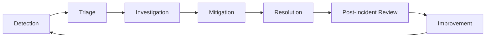

# Incident Response Playbook

This playbook provides a standardized approach to incident management in accordance with the [Operations & Incident Management Standards](../../technologies/platforms/210-operations-incidents.mdc).

## Incident Management Lifecycle



## 1. Incident Detection & Declaration

### Detection Methods

- **Automated Alerts**: Monitoring system triggers based on predefined thresholds
- **User Reports**: Customer support tickets or direct user feedback
- **Internal Discovery**: Team member notices unusual behavior
- **Dependency Notification**: Notification from a third-party service provider

### Incident Declaration Criteria

An incident should be declared when any of the following occur:

- Production service is unavailable or severely degraded
- Critical functionality is impaired
- Data integrity is compromised
- Security breach is suspected
- Significant performance degradation affects user experience

### Declaration Process

1. Assess the situation against declaration criteria
2. Determine preliminary severity (P1-P4)
3. Open an incident ticket in the incident management system
4. Activate the appropriate incident response team
5. Notify stakeholders according to severity

## 2. Incident Response Team Roles

### Incident Commander (IC)

**Responsibilities**:

- Coordinate the overall incident response
- Make critical decisions
- Facilitate communication
- Ensure proper handoffs if the incident spans multiple shifts
- Declare incident closure

### Technical Lead

**Responsibilities**:

- Lead technical investigation
- Coordinate troubleshooting activities
- Propose and evaluate mitigation strategies
- Implement fixes with assistance from subject matter experts

### Communications Lead

**Responsibilities**:

- Provide regular updates to stakeholders
- Draft customer communications
- Document the incident timeline
- Coordinate with external entities if necessary

### Subject Matter Experts (SMEs)

**Responsibilities**:

- Provide domain-specific expertise
- Assist with investigation and mitigation
- Implement fixes in their areas of responsibility

## 3. Severity Levels & Response Expectations

### P1 (Critical) Incidents

**Criteria**:

- Complete service outage
- Data loss or corruption
- Security breach with active exploitation

**Response**:

- **Initial Response Time**: 15 minutes
- **Update Frequency**: Every 30 minutes
- **Escalation**: Executive team after 1 hour without mitigation
- **Required Roles**: All incident roles must be filled
- **War Room**: Required, 24/7 until resolution

### P2 (Major) Incidents

**Criteria**:

- Partial service outage
- Major feature unavailable
- Significant performance degradation affecting many users

**Response**:

- **Initial Response Time**: 30 minutes
- **Update Frequency**: Every 1 hour
- **Escalation**: Management team after 2 hours without mitigation
- **Required Roles**: IC, Technical Lead, and relevant SMEs
- **War Room**: Required during business hours, on-call after hours

### P3 (Minor) Incidents

**Criteria**:

- Minor feature unavailable
- Performance degradation affecting a small subset of users
- Non-critical system component failure

**Response**:

- **Initial Response Time**: 4 hours
- **Update Frequency**: Daily
- **Escalation**: Team leads after 1 day without mitigation
- **Required Roles**: Technical Lead and relevant SMEs
- **War Room**: Optional, as needed

### P4 (Low) Incidents

**Criteria**:

- Cosmetic issues
- Minor inconveniences that don't affect core functionality
- Individual user issues with workarounds

**Response**:

- **Initial Response Time**: Next business day
- **Update Frequency**: As needed
- **Escalation**: None unless escalates in severity
- **Required Roles**: Assigned engineer
- **War Room**: Not required

## 4. Communication Templates

### Internal Status Updates

```
INCIDENT #[ID] - [SEVERITY] - [SHORT DESCRIPTION]
Status: [Active/Mitigated/Resolved]
Started: [YYYY-MM-DD HH:MM] UTC
Duration: [Time since incident began]

Current Status:
[Brief description of current situation]

Impact:
- [Specific features/services affected]
- [Number of users affected]
- [Business impact]

Actions Taken:
- [Action 1]
- [Action 2]

Next Steps:
- [Planned action 1]
- [Planned action 2]

Timeline:
[HH:MM] UTC - [Event]
[HH:MM] UTC - [Event]

Next Update: [YYYY-MM-DD HH:MM] UTC
```

### External Status Update (User-Facing)

```
[Service Name] Status Update

We are currently experiencing [brief description of issue] affecting [service/feature name].

Status: [Investigating/Identified/Mitigated/Resolved]

Impact: [User-friendly description of impact and any workarounds]

We will provide updates as we work to resolve this issue. We apologize for any inconvenience this may cause.

Last updated: [YYYY-MM-DD HH:MM] UTC
```

## 5. Investigation & Mitigation

### Investigation Checklist

- [ ] Review monitoring dashboards and alerts
- [ ] Analyze recent deployments or changes
- [ ] Check system logs for errors
- [ ] Verify infrastructure status
- [ ] Test affected functionality
- [ ] Check dependent service status
- [ ] Review recent relevant incidents for patterns

### Common Mitigation Strategies

1. **Rollback to Previous Version**

   - Revert to the last known good state
   - `kubectl rollout undo deployment/[service-name]`

2. **Traffic Rerouting**

   - Redirect traffic to healthy instances
   - Update load balancer configuration

3. **Scaling Resources**

   - Increase capacity to handle load
   - `kubectl scale deployment/[service-name] --replicas=[count]`

4. **Database Failover**

   - Switch to replica if primary is problematic
   - Verify data consistency after failover

5. **Feature Flag Toggles**

   - Disable problematic features
   - `curl -X POST https://api.example.com/features/[feature-name]/disable`

6. **Cache Clearing**

   - Reset problematic cache data
   - `redis-cli FLUSHDB` (use with caution)

7. **Restart Services**
   - Restart affected components
   - `kubectl rollout restart deployment/[service-name]`

### Validation Steps

- Verify functionality through automated tests
- Perform manual testing of affected features
- Check monitoring dashboards for normalization
- Confirm with affected users if possible

## 6. Incident Resolution

### Resolution Criteria

An incident can be resolved when:

1. Service functionality is restored to normal
2. Root cause is understood (or has a plan for deeper investigation)
3. Mitigations are stable and verified
4. Users are no longer impacted
5. Communication has been provided to all stakeholders

### Resolution Process

1. Verify that all resolution criteria are met
2. Announce resolution to all stakeholders
3. Update incident ticket with final status
4. Schedule post-incident review
5. Hand off any follow-up items to appropriate teams

## 7. Post-Incident Analysis

### Post-Mortem Meeting Agenda

1. **Incident Overview** (5 minutes)

   - Brief summary of the incident
   - Timeline of key events

2. **Impact Assessment** (5 minutes)

   - User impact
   - Business impact
   - Duration

3. **Root Cause Analysis** (20 minutes)

   - What happened?
   - Why did it happen?
   - How did our response perform?

4. **Action Items Discussion** (20 minutes)

   - Prevention measures
   - Detection improvements
   - Response improvements
   - Process improvements

5. **Assign Action Items** (10 minutes)
   - Define owners
   - Set deadlines
   - Clarify expected outcomes

### Root Cause Analysis Techniques

1. **5 Whys Analysis**

   - Start with the problem statement
   - Ask "why" repeatedly to drill down to root causes
   - Typically 5 levels deep, but can vary

2. **Fishbone/Ishikawa Diagram**

   - Categorize potential causes (People, Process, Technology, Environment)
   - Branch out to specific factors within each category
   - Identify relationships between factors

3. **Timeline Analysis**
   - Create a detailed timeline of events
   - Identify decision points and information gaps
   - Look for cascade effects and triggers

### Post-Mortem Document Template

```markdown
# Post-Incident Review: [Incident Title]

## Incident Details

- **Incident ID**: [ID]
- **Date**: [YYYY-MM-DD]
- **Duration**: [HH:MM]
- **Severity**: [P1/P2/P3/P4]

## Executive Summary

[Brief summary of the incident, its impact, and key takeaways]

## Timeline

| Time (UTC) | Event               | Actions Taken   |
| ---------- | ------------------- | --------------- |
| HH:MM      | [Event description] | [Actions taken] |
| HH:MM      | [Event description] | [Actions taken] |

## Impact

- **User Impact**: [Description and metrics]
- **Business Impact**: [Description and metrics]
- **Duration**: [Total downtime or degradation time]

## Root Cause

[Detailed explanation of what caused the incident]

## Contributing Factors

- [Factor 1]
- [Factor 2]

## What Went Well

- [Positive aspect 1]
- [Positive aspect 2]

## What Went Poorly

- [Area for improvement 1]
- [Area for improvement 2]

## Action Items

| Item          | Owner  | Due Date     | Status                       |
| ------------- | ------ | ------------ | ---------------------------- |
| [Description] | [Name] | [YYYY-MM-DD] | [Open/In Progress/Completed] |
| [Description] | [Name] | [YYYY-MM-DD] | [Open/In Progress/Completed] |

## Lessons Learned

[Key insights gained from this incident]
```

## 8. Continuous Improvement

### Action Item Tracking

All action items from post-incident reviews should be:

1. Documented in the team's issue tracking system
2. Assigned a clear owner
3. Given a reasonable deadline
4. Prioritized appropriately with other work
5. Reviewed in team meetings until resolved

### Knowledge Sharing

Lessons from incidents should be shared through:

1. Team presentations
2. Documentation updates
3. Runbook creation or enhancement
4. Training sessions
5. Cross-team knowledge sharing

### Proactive Measures

1. Regular disaster recovery testing
2. Game day exercises
3. Chaos engineering experiments
4. Tabletop incident simulations
5. Regular review of incident metrics and trends

## Appendix: Tool & Resource Reference

### Incident Management Tools

- **Incident Tracking**: [Tool Name] - [Internal URL]
- **Communication**: [Tool Name] - [Internal URL]
- **Status Page**: [Tool Name] - [Internal URL]
- **Alerting**: [Tool Name] - [Internal URL]
- **Dashboards**: [Tool Name] - [Internal URL]

### Key Contacts

- **On-Call Rotation**: [Link to rotation schedule]
- **Executive Escalation**: [Names and contact methods]
- **External Vendors**: [Names and contact methods]
- **Security Team**: [Names and contact methods]
- **Communications Team**: [Names and contact methods]

### Related Documentation

- [Infrastructure Runbook]
- [Deployment Rollback Procedures]
- [Database Recovery Procedures]
- [Security Incident Response Plan]
- [Customer Communication Guidelines]
