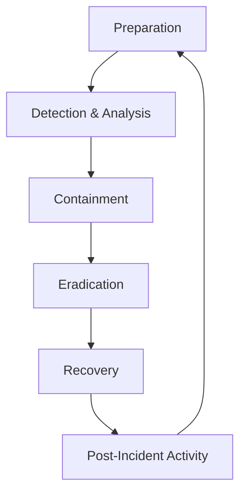

# Security Incident Response Guide

This guide provides a structured approach to security incident response in accordance with the [Security Monitoring Standards](../../technologies/platforms/220-security-monitoring.mdc).

## Incident Response Process Overview



## 1. Incident Classification Matrix

| Severity     | Impact                                                         | Response Time    | Examples                                                                       |
| ------------ | -------------------------------------------------------------- | ---------------- | ------------------------------------------------------------------------------ |
| **Critical** | Severe business impact, data breach, widespread service outage | Immediate (24/7) | Confirmed data breach, ransomware outbreak, critical infrastructure compromise |
| **High**     | Significant impact, business disruption                        | Within 1 hour    | Targeted attack activity, credential theft, suspected data access              |
| **Medium**   | Limited impact, localized issue                                | Within 4 hours   | Isolated malware, suspicious activity, system compromise                       |
| **Low**      | Minimal impact, routine security events                        | Within 8 hours   | Policy violations, reconnaissance attempts, isolated malicious activity        |

## 2. Incident Response Team Roles

### Core Team Roles

| Role                    | Responsibilities                                       | Activation Criteria             |
| ----------------------- | ------------------------------------------------------ | ------------------------------- |
| **Incident Commander**  | Overall coordination, decision making, status tracking | All incidents ≥ Medium severity |
| **Technical Lead**      | Technical investigation, forensics, containment        | All incidents ≥ Medium severity |
| **Communications Lead** | Stakeholder updates, external communications           | All incidents ≥ High severity   |
| **Executive Liaison**   | C-level updates, high-level decision approval          | Critical severity incidents     |
| **Documentation Lead**  | Evidence collection, timeline maintenance              | All incidents ≥ Medium severity |

### Extended Team Members (as needed)

- Legal Counsel
- HR Representative
- Public Relations
- IT Operations
- Subject Matter Experts
- Third-party Security Providers

## 3. Detection & Analysis

### Initial Assessment Checklist

- [ ] **Validate the alert**: Confirm if the alert is a true positive
- [ ] **Establish scope**: Determine affected systems, users, and data
- [ ] **Assess impact**: Evaluate business impact and risk
- [ ] **Assign severity**: Apply the incident classification matrix
- [ ] **Document initial findings**: Record timestamps, indicators, and evidence
- [ ] **Activate appropriate team members**: Based on severity and scope

### Evidence Collection Guidelines

| Evidence Type    | Collection Methods                         | Storage Requirements                      |
| ---------------- | ------------------------------------------ | ----------------------------------------- |
| System Logs      | Use forensic tools, native OS capabilities | Tamper-evident storage, chain of custody  |
| Network Traffic  | PCAP files, netflow data, IDS/IPS logs     | Encrypted storage, timestamp preservation |
| Memory Dumps     | Live memory acquisition tools              | Write-once media, hash verification       |
| Disk Images      | Forensic imaging tools, bit-by-bit copies  | Encrypted storage, hash verification      |
| Application Logs | Log aggregation tools, database queries    | Original format preservation              |
| User Activity    | Authentication logs, access records        | Chronological order, correlation IDs      |

### Indicators of Compromise (IOC) Extraction

```markdown
# IOC Extraction Template

## File Indicators

- File Hashes: [MD5, SHA1, SHA256]
- File Names: [suspicious file names]
- File Paths: [locations used by the attacker]
- File Sizes: [if distinctive]

## Network Indicators

- IP Addresses: [malicious IPs]
- Domains: [malicious domains]
- URLs: [specific malicious URLs]
- Network Services: [ports, protocols]
- User-Agent Strings: [distinctive browser headers]

## System Indicators

- Registry Keys: [malicious registry entries]
- Scheduled Tasks: [persistence mechanisms]
- Service Names: [malicious services]
- Process Names: [malicious processes]
- Process Arguments: [distinctive command lines]

## Account Indicators

- Compromised Accounts: [affected user accounts]
- Created Accounts: [attacker-created accounts]
- Permission Changes: [unexpected privilege changes]
```

## 4. Containment Strategies

### Short-term Containment

| Technique           | Use Cases                                          | Considerations                                               |
| ------------------- | -------------------------------------------------- | ------------------------------------------------------------ |
| Network Isolation   | Active network-based attacks, data exfiltration    | May impact business operations, requires rapid coordination  |
| Account Lockout     | Compromised credentials, suspicious authentication | User productivity impact, potential legitimate lockouts      |
| Process Termination | Malicious code execution, suspicious processes     | Evidence loss risk, potential system instability             |
| System Shutdown     | Severe compromise, ransomware containment          | Service disruption, potential data loss, evidence volatility |
| Traffic Blocking    | C2 communications, ongoing attack traffic          | Requires continuous monitoring for evasion attempts          |

### Example Network Isolation Commands

```bash
# Cisco Network Device
conf t
interface GigabitEthernet0/1
  shutdown
exit

# Windows Firewall (PowerShell)
New-NetFirewallRule -DisplayName "Emergency Isolation" -Direction Outbound -Action Block -Profile Any -Enabled True

# Linux iptables
iptables -A OUTPUT -s [compromised-host-ip] -j DROP
iptables -A INPUT -d [compromised-host-ip] -j DROP

# AWS Security Group
aws ec2 create-security-group --group-name emergency-isolation --description "Emergency isolation" --vpc-id vpc-1a2b3c4d
aws ec2 modify-instance-attribute --instance-id i-1234567890abcdef0 --groups sg-emergency-isolation
```

### Long-term Containment

| Technique            | Use Cases                                          | Implementation Steps                                                                                                                                    |
| -------------------- | -------------------------------------------------- | ------------------------------------------------------------------------------------------------------------------------------------------------------- |
| Credential Rotation  | After credential theft, account compromise         | 1. Identify all affected credentials<br>2. Generate new credentials<br>3. Update all dependent systems<br>4. Verify no access with old credentials      |
| System Hardening     | Vulnerability exploitation, configuration weakness | 1. Apply security patches<br>2. Harden configurations<br>3. Remove unnecessary services<br>4. Implement additional controls                             |
| Network Segmentation | Lateral movement, privilege escalation             | 1. Identify critical network segments<br>2. Implement strict access controls<br>3. Monitor segment boundaries<br>4. Validate segmentation effectiveness |
| Enhanced Monitoring  | Persistent threats, advanced adversaries           | 1. Deploy additional monitoring tools<br>2. Create custom detection rules<br>3. Increase logging verbosity<br>4. Implement proactive hunting            |

## 5. Eradication Techniques

### Malware Removal

```markdown
# Malware Removal Procedure

## Preparation

1. Ensure affected system is isolated
2. Prepare clean recovery media and tools
3. Obtain malware indicators and removal tools
4. Document current system state

## Process

1. Boot to secure environment if possible
2. Run multiple anti-malware scans with different tools
3. Check for persistence mechanisms:
   - Registry entries
   - Startup folders
   - Scheduled tasks
   - Services
   - WMI persistence
   - Boot sector modifications
4. Remove identified malware components
5. Verify removal with additional scans
6. Check for remaining indicators of compromise

## Validation

1. Monitor system behavior
2. Verify system integrity
3. Validate removal of all malicious components
4. Document all removed components
```

### System Rebuild Guidelines

| Phase              | Actions                                                                                                                 | Verification Steps                                                                                         |
| ------------------ | ----------------------------------------------------------------------------------------------------------------------- | ---------------------------------------------------------------------------------------------------------- |
| Backup             | Create forensic copy of affected system<br>Extract necessary configurations<br>Document system role and dependencies    | Verify backup integrity<br>Test data accessibility<br>Validate configuration extraction                    |
| Clean Installation | Use trusted installation media<br>Apply baseline hardening<br>Configure security controls<br>Apply all security patches | Verify installation sources<br>Validate system integrity<br>Check configuration against hardening baseline |
| Data Restoration   | Restore from clean backups only<br>Scan all data before restoration<br>Prioritize critical functions                    | Verify data integrity<br>Scan for malicious content<br>Test functionality of restored data                 |
| Validation         | Test all system functions<br>Verify security controls<br>Monitor for suspicious activity                                | Run vulnerability scans<br>Verify monitoring coverage<br>Test against known IOCs                           |

## 6. Recovery Procedures

### Service Restoration Checklist

- [ ] **Define recovery objectives**: Identify RTOs and RPOs for affected systems
- [ ] **Prioritize critical services**: Determine restoration order based on business needs
- [ ] **Implement enhanced monitoring**: Deploy additional monitoring during recovery
- [ ] **Perform phased restoration**: Restore services in controlled phases
- [ ] **Conduct security testing**: Verify security posture of restored systems
- [ ] **Document restoration actions**: Record all steps taken during recovery
- [ ] **Communicate status updates**: Keep stakeholders informed of progress
- [ ] **Validate business functions**: Ensure business processes are operational

### Example Recovery Timeline

```markdown
# Recovery Timeline Template

## Phase 1: Critical Services (0-24 hours)

- [ ] Restore core authentication systems
- [ ] Reinstate critical business applications
- [ ] Restore external customer-facing systems
- [ ] Validate data integrity for critical systems
- [ ] Implement emergency monitoring measures

## Phase 2: Business Operations (24-72 hours)

- [ ] Restore internal business systems
- [ ] Reinstate collaboration tools
- [ ] Restore secondary business applications
- [ ] Re-establish business workflows
- [ ] Validate cross-system integrations

## Phase 3: Complete Recovery (72+ hours)

- [ ] Restore remaining non-critical systems
- [ ] Re-implement standard security controls
- [ ] Transition from emergency to normal operations
- [ ] Review and adjust security architecture
- [ ] Document lessons learned
```

## 7. Post-Incident Analysis

### Root Cause Analysis Framework

```markdown
# Root Cause Analysis Template

## Incident Overview

- Incident ID: [ID]
- Date/Time: [Timeframe]
- Duration: [Duration]
- Severity: [Severity Level]
- Impact: [Description of Impact]

## Timeline

[Detailed chronological timeline of events]

## Attack Vector Analysis

- Initial Access: [How the attacker first gained access]
- Persistence: [How the attacker maintained access]
- Privilege Escalation: [How the attacker gained higher privileges]
- Lateral Movement: [How the attacker moved within the environment]
- Data Access: [What data was accessed or exfiltrated]

## Root Causes

- Primary Cause: [Main vulnerability or issue that allowed the incident]
- Contributing Factors:
  - [Factor 1]
  - [Factor 2]
  - [Factor 3]

## Defense Failures

- Prevention: [Why preventative controls failed]
- Detection: [Why detection controls failed or were delayed]
- Response: [Challenges in the response process]

## MITRE ATT&CK Mapping

[Map attacker actions to MITRE ATT&CK tactics and techniques]

## Recommendations

- Short-term: [Immediate actions]
- Medium-term: [Actions within 30-90 days]
- Long-term: [Strategic improvements]
```

### Lessons Learned Meeting Agenda

1. **Incident Summary** (15 min)

   - Brief overview of the incident
   - Timeline of key events
   - Impact assessment

2. **Response Effectiveness** (20 min)

   - What went well in our response?
   - What challenges did we encounter?
   - How timely and effective was our response?

3. **Root Cause Discussion** (30 min)

   - Technical root causes
   - Process/procedural factors
   - People/organizational factors

4. **Improvement Opportunities** (30 min)

   - Detection improvements
   - Response process improvements
   - Prevention opportunities

5. **Action Item Development** (25 min)

   - Define specific action items
   - Assign owners and deadlines
   - Establish follow-up process

6. **Wrap-up and Next Steps** (10 min)
   - Summarize key takeaways
   - Confirm action items and ownership
   - Schedule follow-up review

## 8. Incident Response Automation

### Automated Response Playbooks

```yaml
# Example playbook for phishing response
playbook:
  name: "Phishing Email Response"
  triggers:
    - alert_type: "email.phishing"
    - manual_trigger: "phishing_response"

  actions:
    - step: "Validate phishing report"
      automation:
        - action: "email.get_headers"
          parameters:
            message_id: "{{trigger.email_id}}"
        - action: "url.reputation_check"
          parameters:
            url: "{{trigger.extracted_urls}}"
        - action: "file.hash_check"
          parameters:
            file_hash: "{{trigger.attachment_hashes}}"

    - step: "Quarantine message"
      automation:
        - action: "email.quarantine"
          parameters:
            message_id: "{{trigger.email_id}}"
            reason: "Confirmed phishing attempt"
      conditions:
        - "url.reputation_score < 30 OR file.reputation_score < 30"

    - step: "Search for similar messages"
      automation:
        - action: "email.search_similar"
          parameters:
            sender: "{{trigger.sender}}"
            subject: "{{trigger.subject}}"
            timeframe: "24h"
        - action: "email.quarantine_bulk"
          parameters:
            message_ids: "{{email.search_results}}"

    - step: "Block indicators"
      automation:
        - action: "network.block_url"
          parameters:
            url: "{{trigger.extracted_urls}}"
        - action: "email.block_sender"
          parameters:
            sender: "{{trigger.sender}}"

    - step: "Notify users"
      automation:
        - action: "notification.create"
          parameters:
            recipients: "{{email.affected_users}}"
            template: "phishing_alert"
            data:
              threat_type: "Phishing"
              indicators: "{{trigger.extracted_urls}}"

    - step: "Create incident ticket"
      automation:
        - action: "ticket.create"
          parameters:
            title: "Phishing Campaign - {{trigger.subject}}"
            description: "Automated response to phishing attempt"
            indicators: "{{all_extracted_indicators}}"
            severity: "{{calculate_severity}}"
```

### SOAR Integration Points

| Category            | Integration                    | Use Cases                                                          |
| ------------------- | ------------------------------ | ------------------------------------------------------------------ |
| Ticketing Systems   | Jira, ServiceNow, PagerDuty    | Incident tracking, workflow management, team notifications         |
| Communication Tools | Slack, Microsoft Teams, Email  | Team coordination, status updates, automated notifications         |
| Endpoint Security   | EDR platforms, AV solutions    | Host isolation, malware scanning, process termination              |
| Network Security    | Firewalls, WAFs, NAC solutions | Traffic blocking, network isolation, access control                |
| Identity Management | IAM, directory services        | Account lockout, credential reset, permission changes              |
| Threat Intelligence | TIP platforms, OSINT feeds     | IOC enrichment, threat context, reputation lookup                  |
| Cloud Platforms     | AWS, Azure, GCP                | Resource isolation, security group changes, infrastructure changes |

## 9. Special Incident Types

### Data Breach Response

```markdown
# Data Breach Response Checklist

## Immediate Response (First 24 Hours)

- [ ] Form breach response team
- [ ] Preserve evidence
- [ ] Determine breach scope and affected data
- [ ] Contain the breach
- [ ] Engage legal counsel
- [ ] Document all actions taken

## Assessment (24-72 Hours)

- [ ] Identify all affected data types
- [ ] Determine regulatory implications
- [ ] Assess notification requirements
- [ ] Identify affected individuals
- [ ] Document data access/exfiltration details
- [ ] Prepare initial regulatory documentation

## Notification (As Required by Law)

- [ ] Prepare notification content
- [ ] Establish notification methods
- [ ] Set up support resources (call center, FAQ)
- [ ] Execute notification plan
- [ ] Document notification process
- [ ] Prepare for individual inquiries

## Remediation

- [ ] Fix vulnerabilities that led to the breach
- [ ] Enhance security controls
- [ ] Provide identity protection services if required
- [ ] Update security policies and procedures
- [ ] Conduct additional security training
- [ ] Document remediation actions

## Regulatory Reporting

- [ ] Prepare regulatory reports
- [ ] Submit required documentation
- [ ] Respond to regulatory inquiries
- [ ] Track regulatory deadlines
- [ ] Document all regulatory communications
```

### Ransomware Response

```markdown
# Ransomware Response Playbook

## Detection & Initial Response

1. Isolate affected systems immediately
2. Disable network connections
3. Power off unaffected systems if necessary
4. Document initial findings and affected systems
5. Identify ransomware variant if possible
6. Activate incident response team

## Business Continuity

1. Assess critical business functions impacted
2. Activate business continuity plans
3. Establish alternative operational procedures
4. Communicate status to key stakeholders
5. Document business impact assessment

## Investigation

1. Identify initial infection vector
2. Determine the extent of encryption
3. Assess data impact and potential loss
4. Check for data exfiltration indicators
5. Identify potentially compromised accounts
6. Document attack timeline and techniques

## Recovery Options Assessment

1. Evaluate backup availability and integrity
2. Determine restoration priority order
3. Assess decryption possibilities
4. Document recovery strategy and options
5. Get executive approval for recovery approach

## Recovery Operations

1. Rebuild critical systems from clean sources
2. Restore from verified clean backups if available
3. Apply security patches and hardening
4. Implement enhanced monitoring
5. Verify system integrity before reconnecting
6. Document all recovery actions

## Post-Recovery

1. Monitor for reinfection attempts
2. Implement additional security controls
3. Update detection capabilities
4. Conduct user security awareness training
5. Document lessons learned
```

## 10. Tabletop Exercise Templates

### Executive-Level Exercise

```markdown
# Executive Tabletop Exercise: Data Breach Scenario

## Scenario Setup (10 min)

Your organization has just been notified by a law enforcement agency that customer data is being sold on the dark web. Initial investigation confirms the data appears authentic and may involve up to 100,000 customer records including names, addresses, and payment information.

## Phase 1: Initial Response (20 min)

- What are your immediate priorities?
- Who needs to be involved in the response?
- What initial communications are needed?
- What legal and regulatory considerations apply?

## Phase 2: Investigation (20 min)

New information: Technical teams have identified the breach occurred through a compromised vendor account with access to your customer database. The access has been ongoing for approximately 60 days.

- How do you approach the investigation?
- What resources are needed?
- What third parties should be involved?
- How do you manage the vendor relationship?

## Phase 3: Communications (20 min)

New information: News of the breach has leaked to social media and a reporter has contacted your communications team for comment.

- What is your external communication strategy?
- How do you communicate with customers?
- What regulatory notifications are required?
- How do you manage the public relations aspect?

## Phase 4: Recovery & Lessons Learned (20 min)

- What steps will you take to recover from this incident?
- How will you prevent similar incidents in the future?
- What changes to vendor management are needed?
- How will you rebuild customer trust?

## Discussion & Debrief (30 min)

- Key decisions and actions
- Strengths and weaknesses identified
- Improvement opportunities
- Follow-up actions
```

### Technical Team Exercise

```markdown
# Technical Team Tabletop Exercise: Ransomware Response

## Scenario Setup (10 min)

It's 3:00 AM when your monitoring system detects unusual file system activity across multiple servers. Initial investigation shows files being encrypted with a .locked extension and ransom notes appearing on affected systems.

## Phase 1: Containment (25 min)

- What immediate actions will you take?
- How will you prevent further encryption?
- What systems do you prioritize?
- How will you determine the scope of the infection?

## Phase 2: Investigation (25 min)

New information: The ransomware appears to have spread through compromised admin credentials. You've found evidence of PowerShell Empire beacons active for the past week.

- How will you investigate the initial compromise?
- What tools and techniques will you use?
- How will you determine if data was exfiltrated?
- What forensic artifacts are critical to preserve?

## Phase 3: Recovery Planning (25 min)

New information: The ransom demand is for $500,000 in cryptocurrency. Your backup assessment shows most systems have viable backups, but some critical databases have incomplete or potentially compromised backups.

- What is your recovery strategy?
- How will you prioritize systems for recovery?
- What security measures will you implement before restoring?
- How will you verify systems are clean before restoration?

## Phase 4: Lessons Learned (25 min)

- What detection improvements could have helped?
- What containment strategies would you add?
- How would you improve the recovery process?
- What security controls should be enhanced?

## Discussion & Debrief (20 min)

- Technical decision points
- Tool and process gaps
- Documentation needs
- Follow-up actions
```

## 11. Incident Response Metrics

### Key Performance Indicators

| Metric                      | Description                                                    | Target                   |
| --------------------------- | -------------------------------------------------------------- | ------------------------ |
| Mean Time to Detect (MTTD)  | Average time from incident occurrence to detection             | < 24 hours               |
| Mean Time to Respond (MTTR) | Average time from detection to initial response                | < 1 hour                 |
| Mean Time to Contain (MTTC) | Average time from detection to containment                     | < 4 hours                |
| Mean Time to Resolve (MTTR) | Average time from detection to resolution                      | Severity-based           |
| False Positive Rate         | Percentage of alerts that are false positives                  | < 25%                    |
| Incident Recurrence Rate    | Percentage of incidents that are repeats of previous incidents | < 10%                    |
| Automated Response Rate     | Percentage of incidents handled with automation                | > 50%                    |
| Detection by Source         | Distribution of how incidents are detected                     | > 80% by automated tools |

### Maturity Assessment Model

| Capability       | Level 1 (Initial)                        | Level 2 (Developing)                     | Level 3 (Defined)                               | Level 4 (Managed)                            | Level 5 (Optimizing)                           |
| ---------------- | ---------------------------------------- | ---------------------------------------- | ----------------------------------------------- | -------------------------------------------- | ---------------------------------------------- |
| Detection        | Ad-hoc detection, primarily user reports | Basic monitoring tools, limited coverage | Comprehensive detection tools, defined alerting | Advanced detection, correlation capabilities | Predictive detection, behavioral analytics     |
| Response Process | Undefined, reactive response             | Basic playbooks for common incidents     | Documented processes for all incident types     | Measured and refined processes               | Continuously improving, intelligence-driven    |
| Automation       | Manual processes only                    | Limited automation for data collection   | Playbooks partially automated                   | Extensive automation of routine responses    | Self-improving automated responses             |
| Team Capability  | Ad-hoc team, limited skills              | Defined team, basic training             | Dedicated team with specialized skills          | Cross-trained team, advanced capabilities    | Industry-leading expertise, innovation focus   |
| Tools            | Basic, disparate tools                   | Core toolset, limited integration        | Integrated toolset, unified console             | Advanced tools, extensive integration        | Optimized toolset, custom capabilities         |
| Communication    | Unstructured, informal                   | Basic templates, defined audiences       | Comprehensive communication plan                | Tailored, multi-channel approach             | Strategic communications, stakeholder-specific |

## 12. Learning Resources

### Recommended Training

1. **Incident Response Fundamentals**

   - SANS FOR508: Advanced Digital Forensics, Incident Response, and Threat Hunting
   - EC-Council ECIH: EC-Council Certified Incident Handler
   - GIAC GCIH: GIAC Certified Incident Handler

2. **Digital Forensics**

   - SANS FOR500: Windows Forensic Analysis
   - SANS FOR572: Advanced Network Forensics and Analysis
   - AccessData Certified Examiner (ACE)

3. **Threat Hunting**
   - SANS FOR610: Reverse-Engineering Malware
   - GIAC GREM: GIAC Reverse Engineering Malware
   - MITRE ATT&CK Training

### Incident Response Frameworks and Standards

1. **NIST SP 800-61**: Computer Security Incident Handling Guide
2. **ISO/IEC 27035**: Information Security Incident Management
3. **SANS Incident Handler's Handbook**
4. **MITRE ATT&CK Framework**
5. **VERIS Framework**: Vocabulary for Event Recording and Incident Sharing
