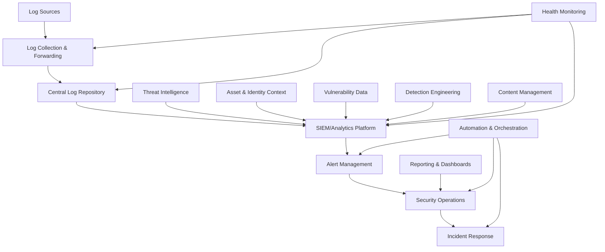

# Security Monitoring Implementation Checklist

This checklist provides a structured approach to implementing security monitoring in accordance with the [Security Monitoring Standards](../../technologies/platforms/220-security-monitoring.mdc).

## Planning Phase

### Monitoring Requirements Analysis

- [ ] **Identify critical assets and systems**

  - [ ] Business-critical applications
  - [ ] Sensitive data repositories
  - [ ] Authentication systems
  - [ ] Network infrastructure
  - [ ] Cloud environments

- [ ] **Define security monitoring objectives**

  - [ ] Threat detection goals
  - [ ] Compliance requirements
  - [ ] Risk management priorities
  - [ ] Detection use cases

- [ ] **Map to compliance requirements**

  - [ ] Regulatory mandates (e.g., GDPR, HIPAA, PCI DSS)
  - [ ] Industry frameworks (e.g., NIST, ISO 27001)
  - [ ] Corporate policies

- [ ] **Establish monitoring metrics**
  - [ ] Detection effectiveness metrics
  - [ ] Response time metrics
  - [ ] Coverage metrics
  - [ ] False positive rates

### Architecture Design

- [ ] **Design centralized logging architecture**

  - [ ] Log collection methods
  - [ ] Transport mechanisms
  - [ ] Storage requirements
  - [ ] Retention policies

- [ ] **Design security monitoring technologies**

  - [ ] SIEM platform selection
  - [ ] EDR/XDR solution integration
  - [ ] Network monitoring tools
  - [ ] API security monitoring

- [ ] **Design alert management workflow**
  - [ ] Alert prioritization framework
  - [ ] Notification channels
  - [ ] Escalation paths
  - [ ] Case management approach

## Implementation Phase

### Log Collection Setup

- [ ] **Configure operating system logging**

  - [ ] Windows Event Logs
  - [ ] Linux/Unix syslog
  - [ ] macOS logs
  - [ ] System audit logs

- [ ] **Configure application logging**

  - [ ] Web server logs
  - [ ] Database audit logs
  - [ ] Application-specific logs
  - [ ] Authentication system logs

- [ ] **Configure network device logging**

  - [ ] Firewall logs
  - [ ] Router/switch logs
  - [ ] Load balancer logs
  - [ ] VPN logs

- [ ] **Configure cloud service logging**

  - [ ] IaaS audit logs
  - [ ] PaaS service logs
  - [ ] SaaS integration logs
  - [ ] Cloud security logs

- [ ] **Implement log transportation**
  - [ ] Log forwarders (e.g., Filebeat, Fluentd)
  - [ ] Secure transport protocols
  - [ ] Buffering and resilience
  - [ ] Bandwidth considerations

### Monitoring Platform Configuration

- [ ] **Install and configure SIEM platform**

  - [ ] Core infrastructure setup
  - [ ] Data ingestion configuration
  - [ ] Parser and normalization rules
  - [ ] User access and roles

- [ ] **Implement log parsing and normalization**

  - [ ] Field extraction
  - [ ] Event categorization
  - [ ] Timestamp normalization
  - [ ] Entity enrichment

- [ ] **Configure data retention and archiving**

  - [ ] Hot/warm/cold data tiers
  - [ ] Archival processes
  - [ ] Retention policy enforcement
  - [ ] Historical search capabilities

- [ ] **Establish monitoring dashboards**
  - [ ] Security operations dashboards
  - [ ] Executive dashboards
  - [ ] Compliance dashboards
  - [ ] Threat hunting dashboards

### Detection Rule Implementation

- [ ] **Develop detection content strategy**

  - [ ] Rule sources (commercial, open source, custom)
  - [ ] Rule management process
  - [ ] Testing methodology
  - [ ] Tuning approach

- [ ] **Implement authentication monitoring**

  - [ ] Failed login detection
  - [ ] Brute force attempt rules
  - [ ] Unusual access time/location alerts
  - [ ] Privilege escalation detection

- [ ] **Implement network security monitoring**

  - [ ] Suspicious connection rules
  - [ ] Data exfiltration detection
  - [ ] Scanning/reconnaissance alerts
  - [ ] Unusual protocol usage rules

- [ ] **Implement endpoint security monitoring**

  - [ ] Malware detection rules
  - [ ] Suspicious process execution
  - [ ] Unauthorized software alerts
  - [ ] Configuration change detection

- [ ] **Implement application security monitoring**

  - [ ] API abuse detection
  - [ ] Injection attempt alerts
  - [ ] Session manipulation rules
  - [ ] Business logic abuse detection

- [ ] **Implement data security monitoring**
  - [ ] Sensitive data access alerts
  - [ ] Unauthorized data transfer rules
  - [ ] Database activity monitoring
  - [ ] Data loss prevention integration

## Testing Phase

### Detection Validation

- [ ] **Develop testing methodology**

  - [ ] Test case development
  - [ ] Testing schedule
  - [ ] Validation metrics
  - [ ] Documentation requirements

- [ ] **Conduct attack simulation tests**

  - [ ] Credential-based attacks
  - [ ] Network-based attacks
  - [ ] Malware scenarios
  - [ ] Data exfiltration scenarios

- [ ] **Validate detection coverage**

  - [ ] Test against MITRE ATT&CK framework
  - [ ] Coverage validation by system type
  - [ ] Coverage validation by attack phase
  - [ ] False positive/negative analysis

- [ ] **Perform tuning iterations**
  - [ ] Adjust rule thresholds
  - [ ] Refine correlation logic
  - [ ] Enhance contextual enrichment
  - [ ] Optimize alert fidelity

### Alert Management Testing

- [ ] **Test alert workflow**

  - [ ] Alert generation
  - [ ] Alert notification
  - [ ] Alert escalation
  - [ ] Alert closure

- [ ] **Validate alert prioritization**

  - [ ] Severity assignment accuracy
  - [ ] Risk-based prioritization
  - [ ] Business impact alignment
  - [ ] Workload distribution

- [ ] **Test incident creation**
  - [ ] Automatic vs. manual creation
  - [ ] Data population
  - [ ] Linking related alerts
  - [ ] Evidence preservation

## Operational Phase

### Security Operations Procedures

- [ ] **Develop monitoring operations manual**

  - [ ] Daily operations procedures
  - [ ] Maintenance processes
  - [ ] Troubleshooting guides
  - [ ] Escalation procedures

- [ ] **Establish alert triage process**

  - [ ] Initial assessment procedure
  - [ ] Investigation checklist
  - [ ] False positive handling
  - [ ] Escalation criteria

- [ ] **Document incident handoff procedures**

  - [ ] Incident response team integration
  - [ ] Required handoff information
  - [ ] Communication channels
  - [ ] Follow-up processes

- [ ] **Implement health monitoring**
  - [ ] Log collection monitoring
  - [ ] Platform performance checks
  - [ ] Detection rule status
  - [ ] Data flow validation

### Continuous Improvement

- [ ] **Establish regular review cycles**

  - [ ] Daily/weekly alert reviews
  - [ ] Monthly tuning sessions
  - [ ] Quarterly effectiveness reviews
  - [ ] Annual architecture review

- [ ] **Implement threat intelligence integration**

  - [ ] Threat feed ingestion
  - [ ] Indicator matching rules
  - [ ] Intelligence-driven detection
  - [ ] Feedback mechanisms

- [ ] **Develop metrics and reporting**

  - [ ] Detection effectiveness reporting
  - [ ] Operational metrics
  - [ ] Compliance status reporting
  - [ ] Executive summaries

- [ ] **Plan capability enhancement**
  - [ ] New data source integration
  - [ ] Advanced detection techniques
  - [ ] Automation opportunities
  - [ ] Tool integration expansion

## Readiness Assessment

### Coverage Assessment

| Component                  | Basic Coverage                                 | Comprehensive Coverage                             | Advanced Coverage                                        |
| -------------------------- | ---------------------------------------------- | -------------------------------------------------- | -------------------------------------------------------- |
| **Authentication Systems** | Failed logins, account lockouts                | Login anomalies, privilege changes                 | Behavioral analysis, credential theft indicators         |
| **Endpoint Security**      | Malware detection, unauthorized software       | Process behavior monitoring, configuration changes | Advanced persistent threat detection, memory analysis    |
| **Network Security**       | Basic IDS/IPS alerts, firewall blocks          | Traffic analysis, connection monitoring            | Encrypted traffic analysis, advanced protocol inspection |
| **Application Security**   | Error logs, access control failures            | API monitoring, input validation attacks           | Business logic abuse, application behavior analysis      |
| **Data Security**          | Basic DLP alerts, unauthorized access          | Data movement tracking, sensitive data usage       | User behavior analytics for data access, intent analysis |
| **Cloud Security**         | Account access, basic configuration monitoring | Resource provisioning, IAM changes                 | Cross-cloud correlation, cloud-specific threats          |

### Maturity Self-Assessment

| Dimension                  | Level 1                              | Level 2                                      | Level 3                                         | Level 4                                             | Level 5                                                   |
| -------------------------- | ------------------------------------ | -------------------------------------------- | ----------------------------------------------- | --------------------------------------------------- | --------------------------------------------------------- |
| **Log Collection**         | Basic system logs only               | Multiple source types, inconsistent coverage | Comprehensive coverage, standardized collection | Enriched logging, context-aware collection          | Real-time, adaptive collection with intelligence feedback |
| **Detection Capability**   | Simple threshold-based rules         | Basic correlation rules and patterns         | Comprehensive rule sets, use case coverage      | Behavioral analysis, machine learning integration   | Predictive detection, autonomous improvement              |
| **Alert Management**       | Manual triage, basic workflow        | Defined process, prioritization framework    | Automated triage, context enrichment            | Risk-based prioritization, automated investigation  | Intelligent orchestration, autonomous response            |
| **Response Integration**   | Manual handoffs, basic documentation | Defined processes, collaboration tools       | Automated case creation, evidence collection    | Playbook-driven response, orchestration             | Intelligent response, continuous adaptation               |
| **Continuous Improvement** | Ad hoc updates, minimal tuning       | Regular reviews, basic metrics               | Systematic improvement, comprehensive metrics   | Data-driven optimization, effectiveness measurement | Autonomous tuning, predictive enhancement                 |

## Implementation Examples

### SIEM Rule Example (Splunk)

```
# Suspicious Account Behavior Detection Rule

# Search for multiple failed authentication attempts followed by a successful login
index=authentication (action=failure OR action=success) user=*
| bucket span=10m _time
| stats count(eval(action="failure")) as failure_count, count(eval(action="success")) as success_count, values(src_ip) as src_ips, values(action) as actions by _time, user
| where failure_count > 5 AND success_count > 0
| eval distinct_ips=mvcount(src_ips)
| where distinct_ips > 1
| rename _time as timespan
| table timespan, user, failure_count, success_count, distinct_ips, src_ips, actions
| sort -failure_count
```

### Azure Sentinel KQL Query Example

```
// Detect when a user authenticates from multiple countries in a short time period
SigninLogs
| where TimeGenerated >= ago(24h)
| extend country = tostring(LocationDetails.countryOrRegion)
| where isnotempty(country)
| summarize
    countries = make_set(country),
    countriesCount = dcount(country),
    authenticationAttempts = count(),
    latestAttempt = max(TimeGenerated),
    ipAddresses = make_set(IPAddress)
    by UserPrincipalName, bin(TimeGenerated, 1h)
| where countriesCount > 1
| project
    TimeGenerated,
    UserPrincipalName,
    countriesCount,
    countries,
    authenticationAttempts,
    latestAttempt,
    ipAddresses
| order by countriesCount desc, authenticationAttempts desc
```

### Log Collection Example (Filebeat)

```yaml
# Filebeat Configuration for Security Logging

filebeat.inputs:
  - type: log
    enabled: true
    paths:
      - /var/log/auth.log
      - /var/log/secure
    fields:
      log_type: authentication
    fields_under_root: true

  - type: log
    enabled: true
    paths:
      - /var/log/apache2/access.log
      - /var/log/apache2/error.log
      - /var/log/nginx/access.log
      - /var/log/nginx/error.log
    fields:
      log_type: webserver
    fields_under_root: true

  - type: log
    enabled: true
    paths:
      - /var/log/mysql/mysql.log
      - /var/log/postgresql/*.log
    fields:
      log_type: database
    fields_under_root: true

processors:
  - add_host_metadata: ~
  - add_cloud_metadata: ~
  - add_docker_metadata: ~
  - add_kubernetes_metadata: ~

output.elasticsearch:
  hosts: ["elasticsearch:9200"]
  indices:
    - index: "auth-logs-%{+yyyy.MM.dd}"
      when.equals:
        log_type: "authentication"
    - index: "web-logs-%{+yyyy.MM.dd}"
      when.equals:
        log_type: "webserver"
    - index: "db-logs-%{+yyyy.MM.dd}"
      when.equals:
        log_type: "database"
```

## Compliance Mapping

### PCI DSS Monitoring Requirements

| PCI DSS Requirement                           | Monitoring Implementation                                  |
| --------------------------------------------- | ---------------------------------------------------------- |
| **10.1**: Implement audit trails              | Centralized logging of all system components               |
| **10.2**: Implement automated audit trails    | Automated collection of all required event types           |
| **10.3**: Record specific audit trail entries | Ensure all required fields are captured in logs            |
| **10.4**: Synchronize time                    | NTP implementation, timestamp standardization              |
| **10.5**: Secure audit trails                 | Immutable storage, access controls, integrity verification |
| **10.6**: Review logs daily                   | Daily log review processes, automated alerting             |
| **10.7**: Retain logs for at least 1 year     | Retention policy enforcement, archival processes           |

### GDPR Security Monitoring Considerations

- Monitor for unauthorized access to personal data
- Implement specific alerts for potential data breaches
- Ensure monitoring capabilities for data subject rights activities
- Maintain evidence of data protection measures
- Create specific detection rules for data protection violations
- Establish accelerated response workflows for personal data incidents

## Additional Resources

### Reference Architecture Diagram



### Technology Comparison Matrix

| Category                | Open Source Options         | Commercial Options                     | Cloud-Native Options                            |
| ----------------------- | --------------------------- | -------------------------------------- | ----------------------------------------------- |
| **Log Collection**      | Filebeat, Fluentd, Logstash | Splunk Forwarders, QRadar Collectors   | Azure Log Analytics Agent, AWS CloudWatch Agent |
| **SIEM Platforms**      | ELK Stack, Wazuh            | Splunk Enterprise Security, IBM QRadar | Microsoft Sentinel, AWS Security Hub            |
| **Network Monitoring**  | Suricata, Zeek, Snort       | Darktrace, ExtraHop                    | Azure Network Watcher, AWS VPC Flow Logs        |
| **Endpoint Monitoring** | OSSEC, Wazuh Agents         | CrowdStrike Falcon, SentinelOne        | Microsoft Defender for Endpoint, AWS GuardDuty  |
| **Threat Intelligence** | MISP, OpenCTI               | Recorded Future, ThreatConnect         | Microsoft Threat Intelligence, AWS Detective    |
| **Orchestration**       | TheHive, Shuffle            | Splunk SOAR, Palo Alto XSOAR           | Azure Logic Apps, AWS Security Hub              |
