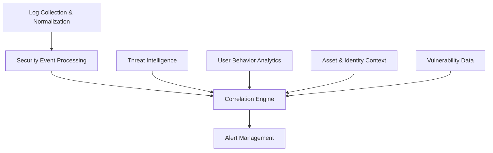

# Threat Detection Implementation Guide

This guide provides practical implementation guidance for threat detection systems in accordance with the [Security Monitoring Standards](../../technologies/platforms/220-security-monitoring.mdc).

## Threat Detection Architecture

### Core Components



1. **Log Collection & Normalization**: Ingests and standardizes security event data
2. **Security Event Processing**: Filters, categorizes, and enriches events
3. **Correlation Engine**: Applies detection rules and identifies patterns
4. **Alert Management**: Prioritizes, routes, and manages security alerts
5. **Context Sources**: Adds intelligence, behavior data, asset context, and vulnerability information

## Detection Rule Types

### 1. Signature-Based Detection

Rules that match known patterns of malicious activity.

```yaml
# Signature-based rule example (YARA-like)
rule WebShell_Detection {
    strings:
        $php_tag = "<?php"
        $suspicious_func1 = "eval("
        $suspicious_func2 = "base64_decode("
        $suspicious_func3 = "system("
        $suspicious_func4 = "exec("
        $suspicious_access = "REQUEST" or "GET" or "POST"

    condition:
        $php_tag and any of ($suspicious_func*) and $suspicious_access
}
```

### 2. Behavioral Detection

Rules that identify abnormal patterns or deviations from baseline behavior.

```yaml
# Behavioral rule example (pseudocode)
rule Abnormal_Authentication_Pattern {
    when:
        user.successful_login == true

    conditions:
        # Geographic impossible travel
        user.previous_login_location exists and
        user.current_login_location exists and
        calculate_distance(
            user.previous_login_location,
            user.current_login_location
        ) > 500 and

        # Time between logins too short for travel
        (user.current_login_time - user.previous_login_time) < 3 hours

    outcome:
        create_alert(
            severity: "high",
            title: "Impossible Travel Scenario Detected",
            description: "User authenticated from locations physically impossible to travel between in the time window",
            user: user.id,
            locations: [user.previous_login_location, user.current_login_location],
            time_difference: (user.current_login_time - user.previous_login_time)
        )
}
```

### 3. Threshold-Based Detection

Rules that trigger when an activity exceeds normal or acceptable limits.

```yaml
# Threshold rule example (pseudocode)
rule Brute_Force_Detection {
    when:
        event.type == "authentication_failure"

    conditions:
        # Count failed attempts within time window
        count(
            filter(events,
                event.type == "authentication_failure" and
                event.username == current.username and
                event.source_ip == current.source_ip and
                event.timestamp > (current.timestamp - 10 minutes)
            )
        ) >= 5

    outcome:
        create_alert(
            severity: "medium",
            title: "Potential Brute Force Attack",
            description: "Multiple failed login attempts detected",
            user: event.username,
            source_ip: event.source_ip,
            attempt_count: count_result
        )
}
```

### 4. Anomaly-Based Detection

Rules that identify statistical anomalies using machine learning or statistical models.

```yaml
# Anomaly rule example (pseudocode)
rule Anomalous_Data_Access {
    when:
        event.type == "data_access" and
        event.data_classification == "sensitive"

    conditions:
        # Statistical anomaly detection
        user_profile = get_user_profile(event.user_id)
        current_access_pattern = extract_access_pattern(event)

        anomaly_score = ml_model.score_anomaly(
            user: event.user_id,
            normal_pattern: user_profile.access_patterns,
            current_pattern: current_access_pattern
        )

        anomaly_score > 0.85 # High confidence anomaly threshold

    outcome:
        create_alert(
            severity: "high",
            title: "Anomalous Data Access Pattern",
            description: "User accessed sensitive data in a pattern that deviates from their normal behavior",
            user: event.user_id,
            data_accessed: event.resource_id,
            anomaly_score: anomaly_score,
            normal_patterns: user_profile.access_patterns,
            current_pattern: current_access_pattern
        )
}
```

## MITRE ATT&CK Framework Integration

### Mapping Detection Rules to Tactics and Techniques

```yaml
# MITRE ATT&CK mappings for a detection rule
rule_id: "AUTH-007"
rule_name: "Privileged Account Brute Force"
description: "Detection of multiple failed attempts on privileged accounts"
detection_logic: |
  count(
    filter(events,
      event.type == "authentication_failure" and
      event.account_type == "admin" and
      event.timestamp > (now() - 10 minutes)
    )
  ) >= 3
severity: "high"

# MITRE ATT&CK mappings
mitre_mappings:
  - tactic: "TA0006" # Credential Access
    techniques:
      - "T1110" # Brute Force
        sub_techniques:
          - "T1110.001" # Password Guessing
          - "T1110.003" # Password Spraying
```

### Example Coverage Matrix

| ATT&CK Tactic        | Coverage % | Key Techniques Covered                             | Coverage Gaps                             |
| -------------------- | ---------- | -------------------------------------------------- | ----------------------------------------- |
| Initial Access       | 75%        | Phishing, Valid Accounts                           | External Remote Services                  |
| Execution            | 60%        | Command/Script Interpreter, User Execution         | Inter-Process Communication               |
| Persistence          | 80%        | Account Manipulation, Create Account               | BITS Jobs, Boot/Logon Autostart Execution |
| Privilege Escalation | 65%        | Access Token Manipulation, Sudo                    | Domain Policy Modification                |
| Defense Evasion      | 50%        | Clear Command History, Indicator Removal           | Signed Binary Proxy Execution             |
| Credential Access    | 85%        | Brute Force, Credential Dumping                    | OS Credential Dumping                     |
| Discovery            | 70%        | Account Discovery, Network Service Scanning        | Cloud Service Discovery                   |
| Lateral Movement     | 60%        | Remote Services, Internal Spearphishing            | Software Deployment Tools                 |
| Collection           | 75%        | Data from Local System, Email Collection           | Input Capture                             |
| Command and Control  | 70%        | Application Layer Protocol, Remote Access Software | Non-Application Layer Protocol            |
| Exfiltration         | 65%        | Automated Exfiltration, Data Transfer Size Limits  | Exfiltration Over Alternative Protocol    |
| Impact               | 55%        | Data Encrypted for Impact, Service Stop            | Endpoint Denial of Service                |

## Critical Detection Use Cases

### 1. Authentication Monitoring

#### Credential Stuffing Detection

**Objective**: Detect automated attempts to use breached credentials across multiple accounts.

**Detection Approach**:

1. Track login attempts across multiple user accounts
2. Monitor for patterns indicative of automation:
   - High velocity of attempts
   - Sequential username targeting
   - Common user-agent strings
   - Similar timing patterns between requests

**Implementation**:

```python
# Pseudocode for credential stuffing detection
def detect_credential_stuffing(auth_events, window_minutes=10):
    # Group by source IP
    ip_grouped_events = group_by(auth_events, "source_ip")

    for ip, events in ip_grouped_events.items():
        # Check if multiple accounts are being targeted
        unique_accounts = distinct(events, "username")

        if len(unique_accounts) < 3:
            continue  # Not enough distinct accounts to consider credential stuffing

        # Check timing patterns
        timing_diffs = []
        for i in range(1, len(events)):
            timing_diffs.append(events[i].timestamp - events[i-1].timestamp)

        # Check for consistent timing (automation indicator)
        timing_stddev = standard_deviation(timing_diffs)

        # Check user agent consistency
        user_agents = distinct(events, "user_agent")

        # Alert if:
        # 1. Many accounts targeted from same IP
        # 2. Consistent timing between attempts
        # 3. Same user agent used for all attempts
        if (len(unique_accounts) > 10 and
            timing_stddev < 0.5 and
            len(user_agents) <= 2):

            create_alert(
                severity="high",
                title="Credential Stuffing Attack Detected",
                source_ip=ip,
                account_count=len(unique_accounts),
                attempt_count=len(events),
                timing_consistency=timing_stddev
            )
```

### 2. Data Exfiltration Monitoring

#### Large Data Transfer Detection

**Objective**: Identify suspicious large data transfers that may indicate data exfiltration.

**Detection Approach**:

1. Establish baseline of normal data transfer volumes by user, time, and destination
2. Monitor for:
   - Unusually large transfers
   - Transfers to new or rare destinations
   - Transfers outside business hours
   - Compressed or encrypted transfers

**Implementation**:

```sql
-- SQL-like detection rule for data exfiltration
-- Assumes a data_transfers table with transfer events
SELECT
    dt.user_id,
    dt.source_ip,
    dt.destination_ip,
    dt.bytes_transferred,
    dt.timestamp,
    dt.file_type
FROM
    data_transfers dt
LEFT JOIN (
    -- Join with user's normal transfer patterns
    SELECT
        user_id,
        AVG(bytes_transferred) as avg_transfer_size,
        STDDEV(bytes_transferred) as stddev_transfer_size
    FROM
        data_transfers
    WHERE
        timestamp > DATE_SUB(NOW(), INTERVAL 30 DAY)
    GROUP BY
        user_id
) user_patterns ON dt.user_id = user_patterns.user_id
WHERE
    -- Transfer is significantly larger than user's normal pattern
    dt.bytes_transferred > (user_patterns.avg_transfer_size + (3 * user_patterns.stddev_transfer_size))

    -- And transfer is to an uncommon destination
    AND dt.destination_ip NOT IN (
        SELECT DISTINCT destination_ip
        FROM data_transfers
        WHERE
            user_id = dt.user_id
            AND timestamp > DATE_SUB(NOW(), INTERVAL 30 DAY)
            GROUP BY destination_ip
            HAVING COUNT(*) > 5  -- Has been used at least 5 times before
    )

    -- And transfer contains sensitive file types
    AND (dt.file_type IN ('zip', 'rar', 'tar', 'gz', 'pgp', 'gpg', 'pdf', 'xls', 'xlsx', 'doc', 'docx')
         OR dt.bytes_transferred > 50000000)  -- Or is larger than 50MB
```

### 3. Privilege Escalation Monitoring

#### Unauthorized Privilege Change Detection

**Objective**: Detect unauthorized changes to user privileges or security group memberships.

**Detection Approach**:

1. Monitor all privilege changes and security group membership modifications
2. Correlate with authorized change requests or approved workflows
3. Alert on:
   - Unexpected privilege increases
   - Unauthorized security group additions
   - Direct manipulations outside management interfaces
   - Self-promotion actions

**Implementation**:

```yaml
# SIEM detection rule (pseudocode)
rule Unauthorized_Privilege_Escalation {
    sources:
        - Directory service audit logs
        - IAM change logs
        - User management system logs

    match:
        event.type in ["user.group.add", "user.role.change", "user.permission.modify"]

    filter:
        # Look for high-value targets
        (event.group contains "admin" or event.role contains "admin") or
        event.permission_level in ["superuser", "system", "root"] or

        # Self-promotion
        event.actor_id == event.target_user_id or

        # Not through approved channels
        event.source_application not in ["identity-manager", "approved-admin-tool"] or

        # No matching approved change request
        not exists(
            change_request where
                change_request.target_user == event.target_user_id and
                change_request.status == "approved" and
                change_request.expiration > event.timestamp
        )

    outcome:
        create_alert(
            severity: "critical",
            title: "Unauthorized Privilege Escalation",
            actor: event.actor_id,
            target_user: event.target_user_id,
            privilege_change: {
                from: event.previous_state,
                to: event.new_state
            },
            source_application: event.source_application
        )
}
```

## Alert Prioritization

### Risk-Based Scoring Model

```python
# Pseudocode for alert risk scoring
def calculate_alert_risk_score(alert):
    base_score = severity_map[alert.severity]  # E.g., Critical=90, High=70, Medium=50, Low=30

    # Adjust based on asset value
    asset_value = get_asset_value(alert.affected_assets)
    asset_multiplier = {
        "critical": 1.5,
        "high": 1.2,
        "medium": 1.0,
        "low": 0.8
    }.get(asset_value, 1.0)

    # Adjust based on threat intelligence
    threat_context = get_threat_intelligence(alert.indicators)
    threat_multiplier = 1.0
    if threat_context.get("known_malicious", False):
        threat_multiplier += 0.3
    if threat_context.get("targeted_attack", False):
        threat_multiplier += 0.4
    if threat_context.get("active_campaign", False):
        threat_multiplier += 0.3

    # Adjust based on user context
    user_context = get_user_context(alert.user_id)
    user_multiplier = 1.0
    if user_context.get("privileged_user", False):
        user_multiplier += 0.4
    if user_context.get("executive", False):
        user_multiplier += 0.3
    if user_context.get("previous_incidents", 0) > 2:
        user_multiplier += 0.2

    # Calculate final score
    risk_score = base_score * asset_multiplier * threat_multiplier * user_multiplier

    # Normalize to 0-100 scale
    return min(max(risk_score, 0), 100)
```

### Alert Triage Matrix

| Risk Score | Response Time   | Notification Method | Investigation Priority       |
| ---------- | --------------- | ------------------- | ---------------------------- |
| 90-100     | Immediate       | Phone + SMS + Email | P1 - All hands required      |
| 75-89      | Within 15 min   | SMS + Email         | P2 - Senior analyst required |
| 50-74      | Within 1 hour   | Email + Dashboard   | P3 - Standard investigation  |
| 25-49      | Within 8 hours  | Dashboard           | P4 - Routine analysis        |
| 0-24       | Within 24 hours | Ticket only         | P5 - Batch review            |

## Detection Testing & Validation

### Red Team Testing

```yaml
# Sample red team testing scenario for detection validation
test_scenario:
  name: "Lateral Movement from Compromised Workstation"
  objective: "Validate detection of lateral movement techniques"
  mitre_techniques:
    - "T1021.001" # Remote Desktop Protocol
    - "T1550.002" # Pass the Hash

  procedure:
    - step: "Compromise initial workstation"
      description: "Simulate successful phishing attack on standard user workstation"
      commands:
        - "powershell -enc [encoded payload]" # Simulate initial compromise

    - step: "Credential theft"
      description: "Extract credentials from workstation"
      commands:
        - "mimikatz.exe privilege::debug sekurlsa::logonpasswords" # Extract credentials

    - step: "Lateral movement using RDP"
      description: "Use extracted credentials to move to server via RDP"
      commands:
        - "mstsc.exe /v:target-server.example.com"

    - step: "Lateral movement using Pass the Hash"
      description: "Use NTLM hash to authenticate to server without password"
      commands:
        - "sekurlsa::pth /user:admin /domain:example.com /ntlm:[hash]"

  expected_detections:
    - rule_id: "EDR-044"
      description: "Mimikatz credential dump detection"
      max_time_to_detect: "5 minutes"

    - rule_id: "NET-023"
      description: "Suspicious RDP connection between workstation and server"
      max_time_to_detect: "15 minutes"

    - rule_id: "AUTH-031"
      description: "NTLM authentication without prior Kerberos attempt"
      max_time_to_detect: "10 minutes"
```

### False Positive Reduction Techniques

1. **Contextual Enrichment**

   - Add business context to security events
   - Incorporate identity, asset, and organizational data
   - Include time-based context (business hours, maintenance windows)

2. **Baselining and Tuning**

   - Establish normal behavior patterns for users, systems, and networks
   - Regularly tune detection rules based on validated alerts
   - Implement suppression rules for known good patterns

3. **Multi-stage Detection Logic**

   - Use multiple conditions and correlation before alerting
   - Implement progressive detection thresholds
   - Require confirmation from multiple data sources

4. **Machine Learning Integration**
   - Train models on confirmed true and false positive examples
   - Use supervised learning for classification of potential alerts
   - Implement feedback loops with analyst input

## Implementation Technologies

### Open Source Security Monitoring Stack

| Component          | Technology Options          | Purpose                           |
| ------------------ | --------------------------- | --------------------------------- |
| Log Collection     | Filebeat, Fluentd, Logstash | Collect and forward security logs |
| Log Storage        | Elasticsearch, ClickHouse   | Store and index security events   |
| SIEM               | Wazuh, Sigma, OpenSearch    | Security monitoring and detection |
| Dashboards         | Kibana, Grafana             | Visualization and monitoring      |
| Alerting           | ElastAlert, Alertmanager    | Alert delivery and management     |
| Threat Intel       | MISP, OpenCTI               | Threat intelligence management    |
| Network Monitoring | Zeek, Suricata              | Network security monitoring       |
| EDR Functions      | OSSEC, Wazuh Agent          | Endpoint detection and response   |

### Commercial Security Monitoring Platforms

| Capability Area               | Leading Solutions                                   |
| ----------------------------- | --------------------------------------------------- |
| Cloud SIEM                    | Microsoft Sentinel, Splunk Cloud, IBM QRadar        |
| EDR/XDR                       | CrowdStrike Falcon, SentinelOne, Microsoft Defender |
| Network Security Monitoring   | Darktrace, ExtraHop, Vectra AI                      |
| User Behavior Analytics       | Exabeam, Gurucul, Securonix                         |
| Threat Intelligence Platforms | ThreatConnect, Recorded Future, Anomali             |

## Scaling Security Monitoring

### High-Volume Handling Techniques

1. **Pre-filtering**

   - Filter noisy events at collection time
   - Normalize and deduplicate early in the pipeline
   - Sample high-volume, low-value events

2. **Tiered Storage**

   - Hot storage for recent/searchable data
   - Warm storage for medium-term retention
   - Cold storage for compliance/archival

3. **Distributed Processing**

   - Horizontally scale processing nodes
   - Implement partitioning by data source or time
   - Use stream processing for real-time analysis

4. **Aggregation & Summarization**
   - Store aggregate statistics for high-volume events
   - Implement time-based rollups
   - Use counters and sketches for approximate metrics
