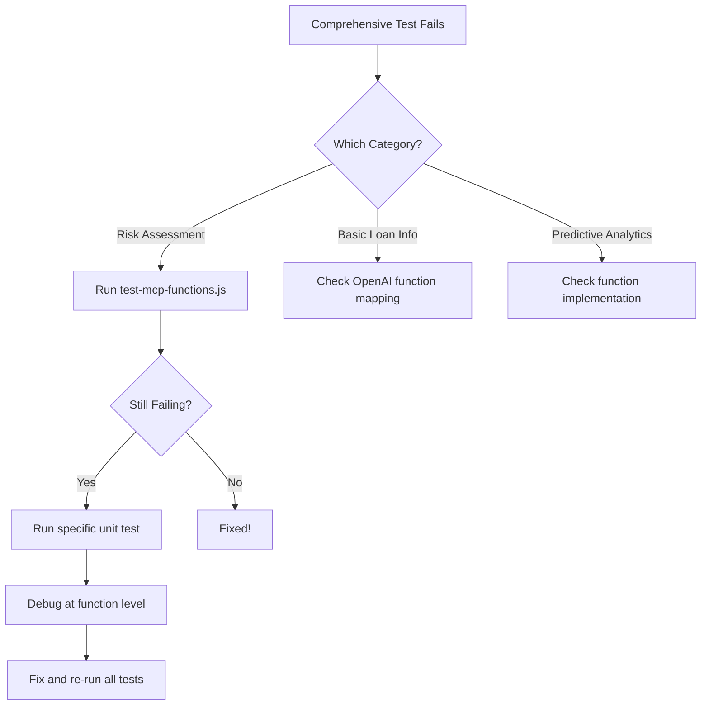

# 🎯 Unified Testing Strategy - LoanOfficerAI MCP POC

## Overview

This document reconciles our two testing approaches:

1. **Existing Tests**: Unit/function-specific tests focusing on individual components
2. **Comprehensive Test**: End-to-end chatbot query testing covering all UI interactions

## Testing Philosophy

```
┌─────────────────────────────────────────────────────────┐
│                    E2E Tests (UI Level)                 │
│         test-chatbot-queries-comprehensive.js           │
│              Tests all 14 chatbot queries               │
└─────────────────────────────────────────────────────────┘
                            ↑
┌─────────────────────────────────────────────────────────┐
│              Integration Tests (API Level)              │
│                 test-mcp-functions.js                   │
│           Tests MCP function calling mechanism          │
└─────────────────────────────────────────────────────────┘
                            ↑
┌─────────────────────────────────────────────────────────┐
│             Unit Tests (Function Level)                 │
│  test-borrower-default-risk.js, test-validation.js     │
│         Tests individual business logic                 │
└─────────────────────────────────────────────────────────┘
```

## Test Categories & When to Use Each

### 1. 🔧 Unit Tests (Bottom Layer)

**Purpose**: Test individual functions and business logic in isolation

**When to use**:

- Developing new functions
- Debugging specific calculation errors
- Validating edge cases
- Testing error handling

**Examples**:

```bash
# Test specific risk calculation
node test-borrower-default-risk.js

# Test validation rules
node test-validation.js
```

### 2. 🔌 Integration Tests (Middle Layer)

**Purpose**: Test API endpoints and MCP function calling mechanism

**When to use**:

- Verifying API contracts
- Testing authentication/authorization
- Checking request/response formats
- Validating MCP protocol implementation

**Examples**:

```bash
# Test MCP integration
node test-mcp-functions.js

# Test direct API endpoints
node server/test-borrower-risk.js
```

### 3. 🎭 E2E Tests (Top Layer)

**Purpose**: Test complete user scenarios through the chatbot interface

**When to use**:

- Validating user experience
- Regression testing before releases
- Demo preparation
- Acceptance testing

**Examples**:

```bash
# Test all chatbot queries
node test-chatbot-queries-comprehensive.js
```

## Unified Test Execution Plan

### Option 1: Progressive Testing (Bottom-Up)

Best for **development and debugging**:

```bash
# 1. Start with unit tests
npm run test:unit

# 2. Then integration tests
npm run test:integration

# 3. Finally E2E tests
npm run test:e2e
```

### Option 2: Smoke Testing (Top-Down)

Best for **quick validation and demos**:

```bash
# 1. Run comprehensive test first
npm run test:comprehensive

# 2. If failures, drill down to specific tests
npm run test:risk-functions  # For risk-related failures
npm run test:loan-queries    # For loan query failures
```

## Test Mapping Strategy

| Chatbot Query          | Comprehensive Test      | Integration Test      | Unit Test                             |
| ---------------------- | ----------------------- | --------------------- | ------------------------------------- |
| Default Risk           | ✅ test-chatbot-queries | ✅ test-mcp-functions | ✅ test-borrower-default-risk         |
| Non-Accrual Risk       | ✅ test-chatbot-queries | ✅ test-mcp-functions | ✅ test-both-risk-functions           |
| High-Risk Farmers      | ✅ test-chatbot-queries | ✅ test-mcp-functions | ✅ server/test-high-risk-farmers      |
| Collateral Sufficiency | ✅ test-chatbot-queries | ❌ Missing            | ✅ server/test-collateral-sufficiency |
| Active Loans           | ✅ test-chatbot-queries | ❌ Not needed         | ❌ Not needed                         |
| Equipment Costs        | ✅ test-chatbot-queries | ❌ Missing            | ❌ Missing                            |

## Recommended NPM Scripts

Add these to `package.json`:

```json
{
  "scripts": {
    "test": "npm run test:all",
    "test:all": "npm run test:unit && npm run test:integration && npm run test:e2e",
    "test:unit": "node test-validation.js && node test-borrower-default-risk.js",
    "test:integration": "node test-mcp-functions.js",
    "test:e2e": "node test-chatbot-queries-comprehensive.js",
    "test:risk": "node test-risk-functions.js && node server/test-high-risk-farmers.js",
    "test:quick": "node test-chatbot-queries-comprehensive.js",
    "test:debug": "node --inspect test-chatbot-queries-comprehensive.js"
  }
}
```

## Test Failure Resolution Flow



## Benefits of This Approach

### 1. **Complementary Coverage**

- Unit tests catch calculation errors
- Integration tests catch API contract issues
- E2E tests catch user experience issues

### 2. **Efficient Debugging**

- Start with comprehensive test to identify problems
- Drill down to specific tests for root cause
- Fix at appropriate level

### 3. **Flexible Execution**

- Quick smoke tests for demos
- Thorough testing for releases
- Targeted testing for development

## Example Workflow

### For a Developer Fixing a Bug:

```bash
# 1. Reproduce with comprehensive test
node test-chatbot-queries-comprehensive.js

# 2. Identify failing category (e.g., "Default Risk")

# 3. Run specific integration test
node test-mcp-functions.js

# 4. Run unit test for precise debugging
node test-borrower-default-risk.js

# 5. Fix the issue

# 6. Verify fix at all levels
npm run test:all
```

### For Pre-Demo Validation:

```bash
# Just run the comprehensive test
node test-chatbot-queries-comprehensive.js

# If all passes, you're ready!
# If not, use the failure output to guide fixes
```

## Next Steps

1. **Implement NPM scripts** in package.json
2. **Create test groups** for related functionality
3. **Add CI/CD integration** to run appropriate test levels
4. **Document test data dependencies** for each level
5. **Create performance benchmarks** for each test level

---

_This unified approach ensures both thorough testing and efficient development workflows._
